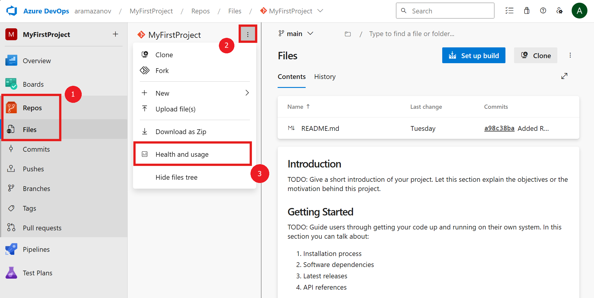

###  New "Health and usage" panel in repo file hub 

As Git repositories grow, they accumulate commits, blobs, and other data, which can increase the load on Azure DevOps infrastructure, impacting performance and user experience. Maintaining a healthy repository is key to ensuring consistent performance and reliability.

To support this, we now monitor several factors like repository size, commit frequency, contents, and structure. If your repository begins to strain the infrastructure, you may receive a notification with recommendations for corrective action. By managing your repository’s health, you can prevent disruptions and ensure smooth operations.

To check your repository’s health, go to Azure Repos, > Files, and choose “Health and usage” from the ellipsis menu to access the Repository health and usage panel.

> [!div class="mx-imgBorder"]
> 