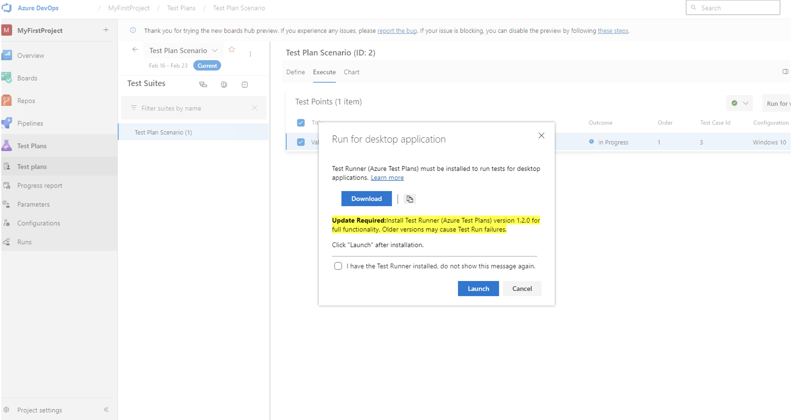

### Quick Copy and Import with Test Plan or Suite ID 

You can now handle multiple test plans in Azure Test Plans with ease! Recognizing the challenges previously faced with long dropdown menus for importing, copying, or cloning test cases—especially for extensive plans or suites—we've taken steps to streamline your workflow.

We're excited to announce the Test Plan and Suite ID Search feature. Enter your Test Plan or Suite ID for swift importing or copying of Test Cases without any delays. This update is part of our ongoing commitment to improve your test management experience, making it more intuitive and less time-consuming.

> [!div class="mx-imgBorder"]
> 

### Update for Azure Test Runner

We're excited to share that Azure Test Runner has been updated to a newer version. This update improves stability and performance, allowing you to run your tests without interruptions or delays. The older version of Azure Test Runner is no longer supported. For the best performance and dependability of your testing operations, we recommend that you update to the newest version as soon as possible.

**What's New?**

* **Enhanced Stability and Performance:** 
We've made significant improvements to the Test Runner, addressing issues some users experienced. This upgrade ensures a more reliable testing process, minimizing disruptions to your work. 
* **Upgrade Prompt:**
To make the transition to the new version seamless, you'll encounter a prompt to upgrade. This ensures everyone can easily move to the improved version at your convenience, enhancing compatibility and performance.

> [!div class="mx-imgBorder"]
> 