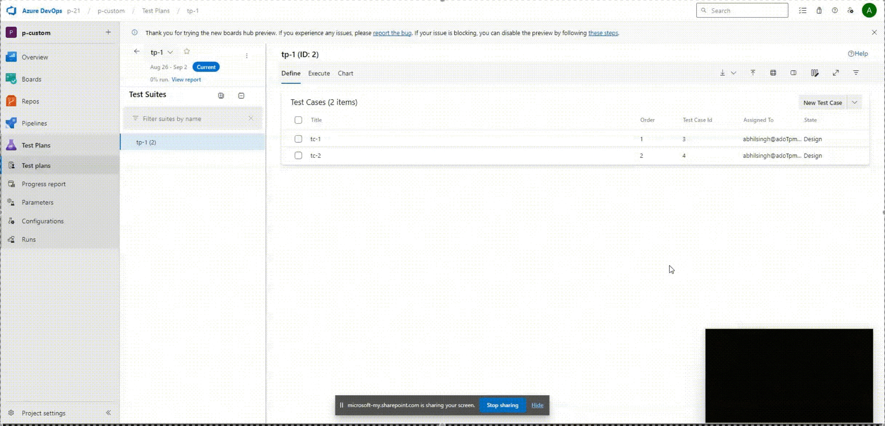

### Export Test Cases with Custom Columns in XLSX Format

We’re excited to announce that, based on your feedback, Test Plans now allows exporting test cases in XLSX format with custom columns included. This enhancement will give you more flexibility and control over the information you export. We look forward to hearing your thoughts! If you encounter any issues or have feedback, please don’t hesitate to let us know.

> [!div class="mx-imgBorder"]
> 

