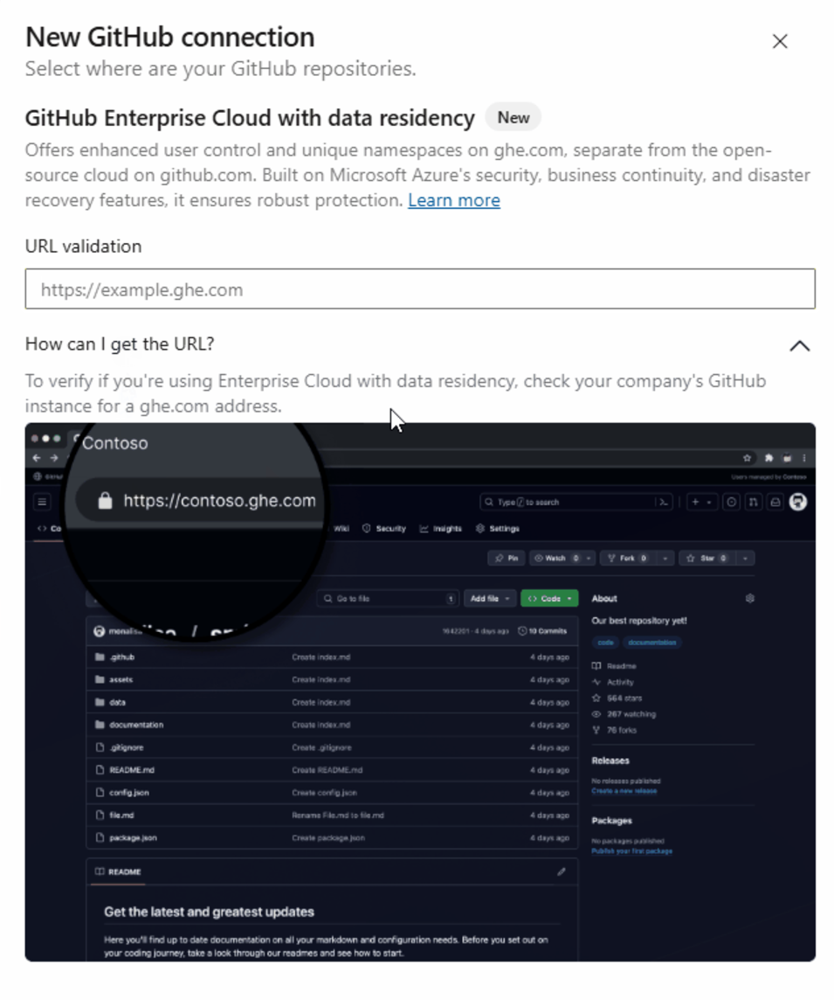

### Azure Boards Integration with GitHub Enterprise Cloud with Data Residency

Azure Boards now supports integration with GitHub Enterprise Cloud organizations that have data residency enabled. This update aligns with [GitHub’s September 2024 announcement](https://github.blog/engineering/engineering-principles/github-enterprise-cloud-with-data-residency/) introducing data residency for Enterprise Cloud customers, starting with those in the European Union (EU).

To connect an Azure Boards project to your GitHub Enterprise Cloud organization with data residency:

  1. Create a new connection in Azure Boards.
  2. Select the **GitHub Enterprise Cloud with data residency** option.

> [!div class="mx-imgBorder"]
> 

> [!div class="mx-imgBorder"]
> 