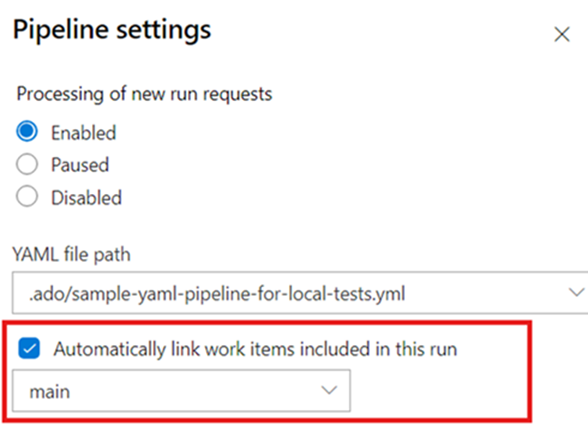
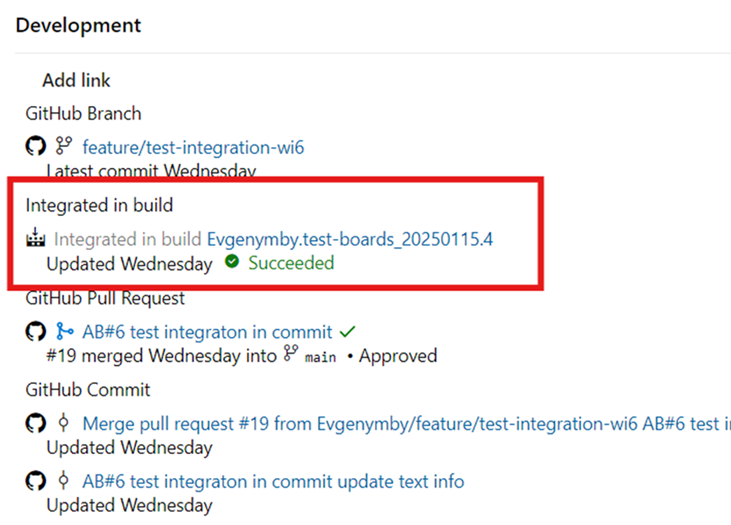

### GitHub Integration: Build Links for YAML Pipelines

We're committed to achieving feature parity between YAML and Classic Pipelines. One key missing feature was the ability to provide an "Integrated in build" link when your repository is hosted in GitHub. With our latest release, we've addressed this gap by adding an option in YAML pipeline settings for you to check:

> [!div class="mx-imgBorder"]
> 

Once the build is complete, the corresponding link will automatically appear on the associated work items, improving the overall traceability story.

> [!div class="mx-imgBorder"]
> 

### Boards + GitHub integration improvements

We're continuously improving the Boards + GitHub integration to close usability gaps and bring it in line with the experience you're familiar with in Azure Repos.

With this update, we've introduced several improvements to streamline how branches, pull requests, and commits are linked to work items:

* When a GitHub branch is linked to a work item, any associated pull requests will now be automatically linked. No need to manually use AB#.

* Once a pull request is merged, the merge commit will be automatically linked to the work item.

* If the branch is deleted after the pull request is merged, the branch link will be automatically removed from the work item.
These improvements make it easier to track your development progress and maintain clean, up-to-date work item associations.

These improvements make it easier to track your development progress and maintain clean, up-to-date work item associations.

Add video to post: 
github-boards-integration-improvements-1.mp4

### Delivery Plans Limit Increased

We increased the maximum Delivery Plan limit per project from 1,000 to 1,500.

