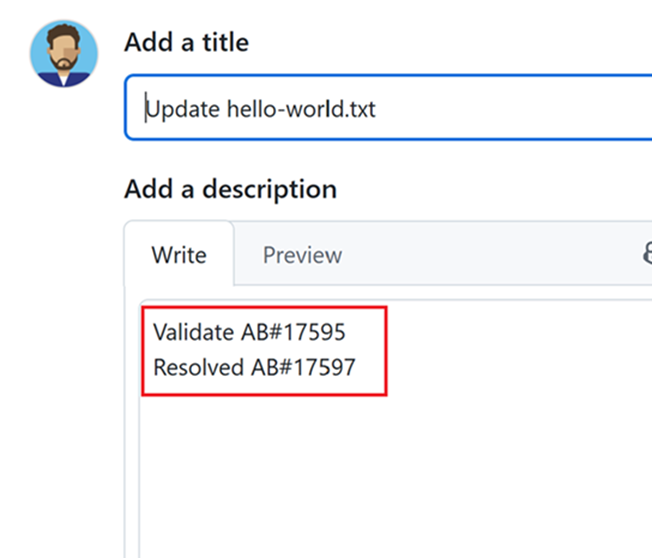

### GitHub Integration: State Transition Support

We’ve expanded our support for linking GitHub pull requests to Azure Boards work items! Previously, only the `Fixes AB#{ID}` keyword was supported. With this update, you can now use `{State or Category} AB#{ID}` to automatically transition work items to the desired state on merge.

If the GitHub pull request description includes a state name (e.g., `Validate AB#1234`), the linked work item's state will be updated as a result. If the state name isn’t recognized, we check if it matches a state category (like `Resolved`). If it does, the work item is transitioned to the first available state within that category. 

> [!div class="mx-imgBorder"]
> 

If no matching state or category is found, the keyword is ignored and the state on the work item won't be updated.
    
Finally, the `Fixes AB#{ID}` keyword continues to work as expected, defaulting to the &quot;Closed&quot; state value.
