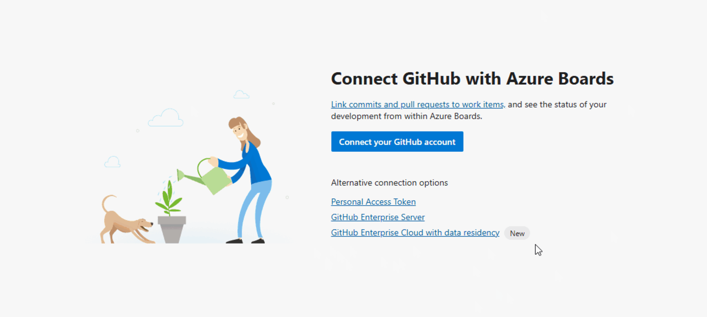
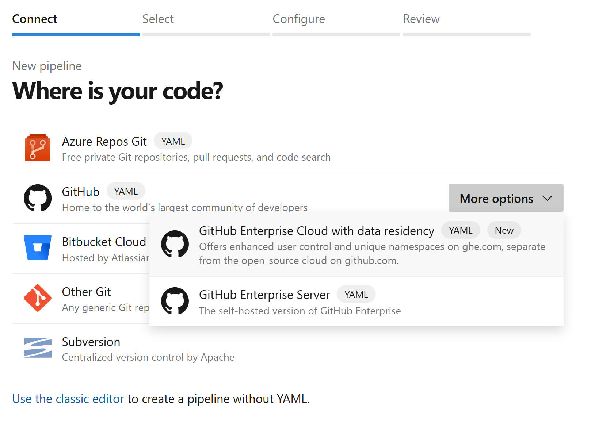
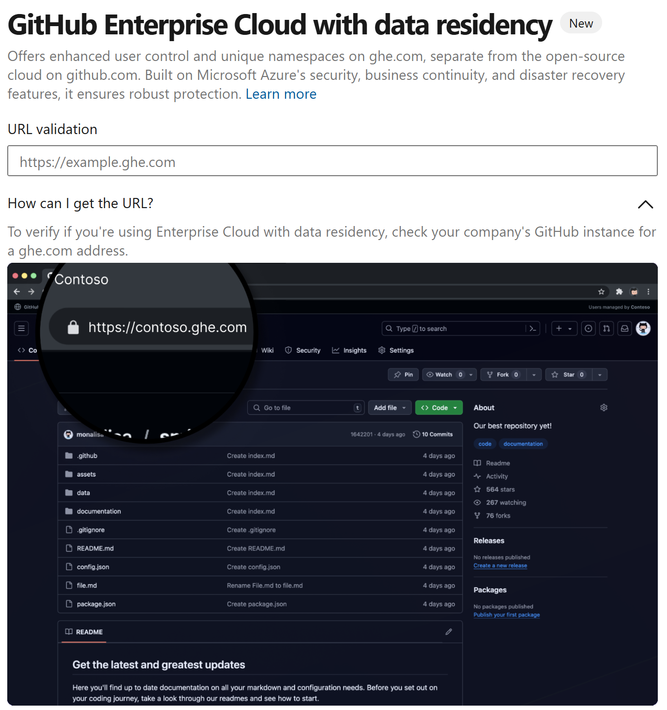

### Azure Boards and Azure Pipelines integration with GitHub Enterprise Cloud (data residency enabled)

Azure Boards and Azure Pipelines now supports integration with GitHub Enterprise Cloud organizations that have data residency enabled. This update aligns with [GitHub’s September 2024 announcement](https://github.blog/engineering/engineering-principles/github-enterprise-cloud-with-data-residency/) introducing data residency for Enterprise Cloud customers.

* To connect an Azure Boards project:

Create a new connection in Azure Boards. Then select the **GitHub Enterprise Cloud with data residency** option.

> [!div class="mx-imgBorder"]
> 

* To connect an Azure Pipeline:

Create a new Pipeline and select GitHub > More Options > GitHub Enterprise Cloud with data residency.

> [!div class="mx-imgBorder"]
> 

    Then enter the URL of your GitHub Enterprise Cloud organization.

> [!div class="mx-imgBorder"]
> 

    After your https://organization.ghe.com url is validated, the experience is same as it has always been, and you can select your GitHub repositories.