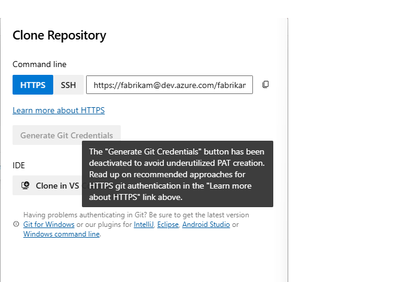

### Removal of Generate Git Credentials button in Repos and Wiki

The **Generate Git Credentials** button has been removed from the **Clone Repository** dialogs in the Repos and Wiki UI to support the transition to Microsoft Entra tokens for authentication in Git operations. Previously, selecting this button generated a new Personal Access Token (PAT) with the `vso.code` scope, active for seven days. Each use created a new PAT, often resulting in unnecessary credentials.

> [!div class="mx-imgBorder"]
> 

To enhance security and streamline authentication, consider using Entra tokens for ad-hoc Git clone operations in Repos and Wiki. Documentation is available to help you configure authentication via the  [command line](/azure/devops/repos/git/auth-overview?view=azure-devops&tabs=Windows) or within the [Git Credential Manager](/azure/devops/repos/git/set-up-credential-managers?view=azure-devops) (GCM).

While PATs remain available for Git operations, they must now be manually created with the appropriate `vso.code` scope from the Personal Access Token page. Ensure that PATs are only active as long as needed and revoked when no longer in use. As a best practice, store PATs securely in a secret management service such as Azure Key Vault (AKV) and rotate them regularly.

### Update to Azure DevOps Allowed IP addresses

We’re thrilled to announce ongoing improvements to our networking infrastructure to enhance performance and reliability. As part of this effort, new IP addresses are being introduced. To ensure uninterrupted access, please add the new IP addresses to your firewall allow list as soon as possible.

**IP V4 Ranges:**
* 150.171.22.0/24
* 150.171.23.0/24
* 150.171.73.0/24
* 150.171.74.0/24
* 150.171.75.0/24
* 150.171.76.0/24

**IP V6 Ranges:**
* 2620:1ec:50::/48
* 2620:1ec:51::/48
* 2603:1061:10::/48

For more details, visit our blog: [Update to Azure DevOps Allowed IP addresses](https://devblogs.microsoft.com/devops/update-to-ado-allowed-ip-addresses/).
