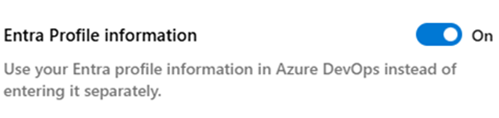
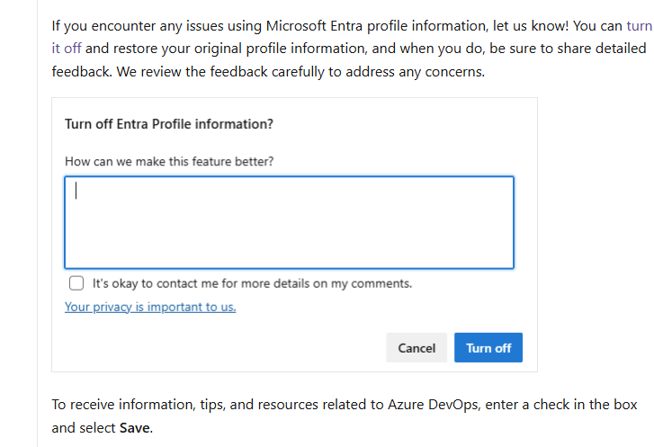

### Microsoft Entra profile information (preview)

Last fall, we introduced the integration of [Microsoft Entra profile information](/azure/devops/organizations/settings/set-your-preferences?view=azure-devops&tabs=preview-page) in Azure DevOps, removing the need for separate profile updates. Over the coming weeks we'll make it the default experience for more users. 

> [!div class="mx-imgBorder"]
> 

The preview is expected to last a month or two, and after that this will be the way profile information works for Entra users in Azure DevOps. If you need to opt-out during the preview, please share feedback as to why, so we can address any issues during the preview.

> [!div class="mx-imgBorder"]
> 

### Basic access included with GitHub Enterprise

Starting this week, we're including Azure DevOps Basic usage rights with GitHub Enterprise licenses and automating the experience for Azure DevOps customers.

If you're using GitHub Enterprise Cloud with Microsoft Entra you'll be automatically recognized in Azure DevOps. Your access level will be set to “GitHub Enterprise,” and you won't accrue additional charges in Azure DevOps [Learn more about access for GitHub Enterprise users](/azure/devops/organizations/accounts/faq-user-and-permissions-management?view=azure-devops).

Initially this capability will be limited to GitHub Enterprise Cloud customers, but we’ll be adding GitHub Enterprise Cloud with Data Residency customers soon.

### Azure DevOps Allowed IP addresses

We are thrilled to announce significant upgrades to our networking infrastructure, aimed at enhancing the performance and reliability of our service. Please add below new IP addresses to your firewall allow list as soon as possible to ensure continuous service during our infrastructure upgrade.

**IP V4 Ranges:**
* 150.171.22.0/24
* 150.171.23.0/24
* 150.171.73.0/24
* 150.171.74.0/24
* 150.171.75.0/24
* 150.171.76.0/24

**IP V6 Ranges:**
* 2620:1ec:50::/48
* 2620:1ec:51::/48
* 2603:1061:10::/48

**ExpressRoute IP V4 Ranges:**
* 150.171.73.14/32
* 150.171.73.15/32
* 150.171.73.16/32
* 150.171.74.14/32
* 150.171.74.15/32
* 150.171.74.16/32
* 150.171.75.14/32
* 150.171.75.15/32
* 150.171.75.16/32
* 150.171.76.14/32
* 150.171.76.15/32
* 150.171.76.16/32
* 150.171.22.17/32
* 150.171.22.18/32
* 150.171.22.19/32
* 150.171.23.17/32
* 150.171.23.18/32
* 150.171.23.19/32

**ExpressRoute IP V6 Ranges:**
* 2603:1061:10::14/128
* 2603:1061:10::15/128
* 2603:1061:10::16/128
* 2603:1061:10:1::14/128
* 2603:1061:10:1::15/128
* 2603:1061:10:1::16/128
* 2603:1061:10:2::14/128
* 2603:1061:10:2::15/128
* 2603:1061:10:2::16/128
* 2603:1061:10:3::14/128
* 2603:1061:10:3::15/128
* 2603:1061:10:3::16/128
* 2620:1ec:50::17/128
* 2620:1ec:50::18/128
* 2620:1ec:50::19/128
* 2620:1ec:51::17/128
* 2620:1ec:51::18/128
* 2620:1ec:51::19/128

Please be advised that these new ExpressRoute IP ranges will be added to ExpressRoute’s “Azure Global Services” BGP community in March.
For more details please visit our blog, [Update to Azure DevOps Allowed IP addresses](https://devblogs.microsoft.com/devops/update-to-ado-allowed-ip-addresses/).

 