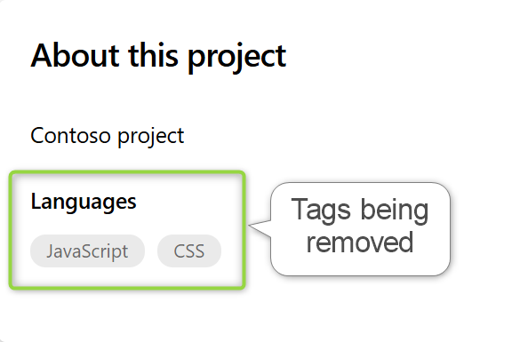

### Deprecation of Languages statistics tags from the Project Summary Page

In the coming weeks, we'll be deprecating the Languages statistics tags from the Project Summary page. The removal of these tags help to optimize the performance, resulting in faster load times and a more responsive interface.

There are no actions that need to be taken from your side and should be a seamless transition.

> [!div class="mx-imgBorder"]
> 

### Overlapping secrets for Azure DevOps OAuth

We're excited to introduce the new overlapping secrets feature in Azure DevOps OAuth, designed to enhance security, and streamline secret rotations. This feature allows you to add a new secret to your OAuth client while the old secret remains valid, ensuring a seamless transition and continuous operation of your applications. You can manage these secrets programmatically via API or through the Visual Studio App page UI. The secret lifespan of new secrets has been reduced to 60 days.

Azure DevOps OAuth is planned for deprecation in 2026, and we encourage developers to migrate to [Microsoft Entra ID OAuth](/azure/devops/integrate/get-started/authentication/entra-oauth?view=azure-devops) for improved security features and longer-term investment. In the interim, we recommend regularly rotating your secrets using our new overlapping secrets feature.

