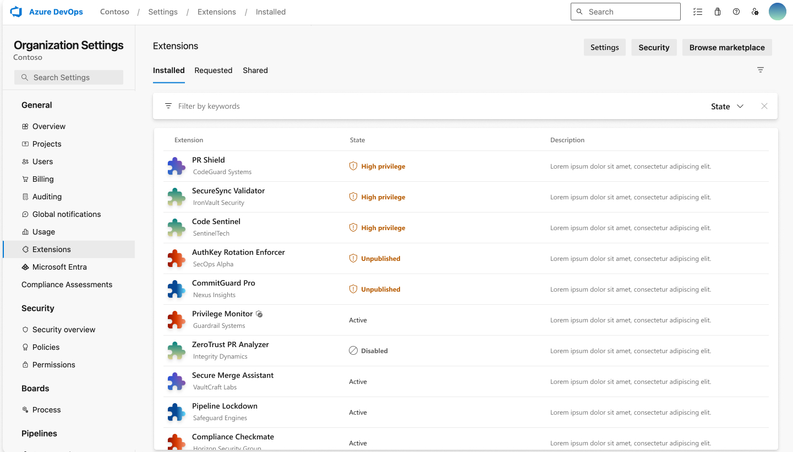

### Manage high privilege scopes, pipeline decorators, and unpublished extensions

Azure DevOps extensions improve product functionality and workflows, but those with high privilege scopes may pose various risks.

A new feature flags these scopes on each organization's admin page and the Visual Studio Marketplace installation page, helping administrators make informed decisions. Unpublished extensions and pipeline decorators are also flagged for administrator awareness and appropriate actions.

> [!div class="mx-imgBorder"]
> 

For more information, visit  [documentation](https://learn.microsoft.com/azure/devops/marketplace/manage-high-privilege-extensions?view=azure-devops) page.