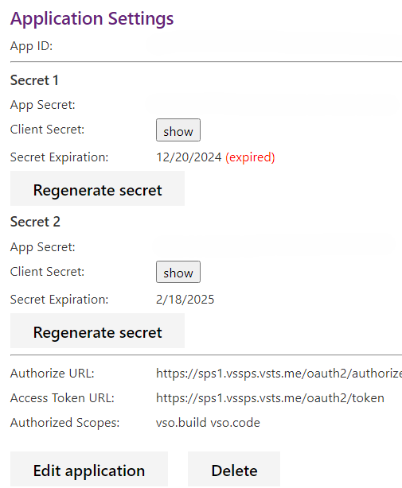

### Manage high privilege scopes, pipeline decorators, and unpublished extensions

Azure DevOps extensions improve product functionality and workflows, but those with high privilege scopes may pose various risks.

We've added a new feature that flags these scopes on each organization's admin page and the Visual Studio Marketplace installation page, helping administrators make informed decisions. Unpublished extensions and pipeline decorators are also flagged for administrator awareness and appropriate actions.

> [!div class="mx-imgBorder"]
> 

For more information, visit  [documentation](/azure/devops/marketplace/manage-high-privilege-extensions) page.

### Overlapping Secrets for OAuth apps

Azure DevOps has introduced Overlapping Secrets for OAuth apps—a new feature available on both UI and API designed to streamline secret rotation and reduce downtime. 

> [!div class="mx-imgBorder"]
> 

With overlapping secrets, developers can generate a new secret while the old one remains valid, ensuring uninterrupted access during secret rotations. With this update, we also reduce the default secret validity period to 60 days.  As Azure DevOps OAuth apps approach deprecation in 2026, this update provides a critical security improvement for teams still relying on them. Try it today to simplify your secret management and improve resilience. Learn more in our blog post.