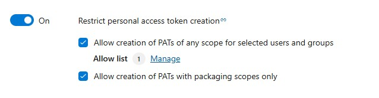

### Restrict personal access token (PAT) creation organization policy now in public preview

We’ve introduced a new organization-level policy in Azure DevOps—Restrict personal access token (PAT) creation—now available in public preview. This long-requested feature allows Project Collection Administrators to control who can create or regenerate PATs, helping reduce token sprawl and improve security. When enabled, only users on an allowlist can generate PATs, with optional support for packaging scopes. The policy also blocks global PAT usage unless explicitly permitted. Learn more about this policy and best practices for implementing this change in [our blog post](https://devblogs.microsoft.com/devops/restricting-pat-creation-in-azure-devops-is-now-in-preview/)!

> [!div class="mx-imgBorder"]
> 

### Removal of expired Azure DevOps OAuth Apps

As we prepare for the end-of-life for Azure DevOps OAuth apps in 2026, we'll begin regularly removing apps with secrets that have expired more than six months ago (180 days ago). App owners of these inactive apps will be informed and if there’s any further need for the app registration between now and Azure DevOps OAuth’s end-of-life in 2026, you are asked to rotate the app secret before June 9 when we begin app deletions. [Learn more in our blog post](https://devblogs.microsoft.com/devops/spring-cleaning-cta-for-azure-devops-oauth-apps-with-expired-or-long-living-secrets/).

### Azure DevOps login flow no longer relies on Azure Resource Manager audience

We've removed a dependency on the Azure Resource Manager (ARM) resource when logging in or refreshing Entra access tokens used to access Azure DevOps. The ARM resource is often associated with the [Azure portal](https://portal.azure.com), and admins may want to restrict which users in their tenant can access the portal through Conditional Access policy (CAP) enforcement.

Due to ADO's previous reliance on ARM, admins had to permit all ADO users to bypass the ARM CAPs in order to use ADO. This is no longer necessary as we've removed the ARM resource audience requirement during signin and refresh token flows. 

There remain a couple of notable exceptions. The following ​user groups may need continued access to ARM:
1. Billing admins need access to ARM to setup billing and access subscriptions
2. Service Connection creators require continued access to ARM for ARM role assignment and updates to MSIs.

### New Microsoft Entra OAuth scopes
Azure DevOps has introduced two new Microsoft Entra OAuth scopes, vso.pats and vso.pats_manage to enhance security and control over personal access token (PAT) lifecycle management APIs. These scopes are now required for delegated flows that involve PAT creation and management, replacing the previously broad user_impersonation scope. This change enables app owners to reduce the permissions needed by their app to access PAT APIs. Downscope your `user_impersonation` apps to the minimum scopes needed today!

### Request Access URL availability

Azure DevOps administrators can disable the [**Request Access**](/azure/devops/organizations/accounts/disable-request-access-policy?view=azure-devops) policy and provide a URL for users to request access to an organization or project. This URL, previously available only to new users, is now also shown to existing users on the 404 page. To maintain confidentiality, the request access URL is displayed regardless of the project's existence.