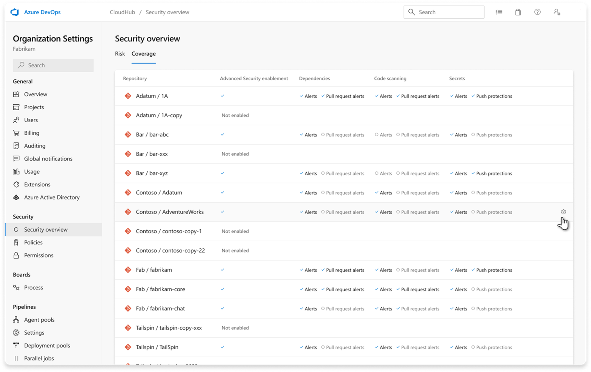

### Security overview coverage tool-specific enablement status

The coverage page of Advanced Security's security overview now shows a detailed breakdown of enablement status per scan tool. For dependency scanning, code scanning, and secret scanning, you can view fine-grained enablement status for all of your repositories in your organization. 

> [!div class="mx-imgBorder"]
> 

For more details, see [Security overview for Advanced Security](https://learn.microsoft.com/en-us/azure/devops/repos/security/github-advanced-security-security-overview?view=azure-devops#viewing-security-insights). 
=======
ms.date: 1/14/2025
ms.topic: include
---

### Commit-less builds supported for dependency scanning 

Dependency scanning no longer requires a new commit to trigger a results submission. With this update, all builds will submit detected components for vulnerability analysis, whether or not they include commit changes. This enhancement streamlines security workflows and broadens scan coverage.

### File previews and annotations for CodeQL scans using sourcesFolder

Now, when using the `sourcesFolder` variable in CodeQL builds, file previews and annotations display accurately in alerts and pull requests, giving you consistent, reliable visibility into scan results.
>>>>>>> 5e53b7659a203f3348a02a532059e241c405fe22
