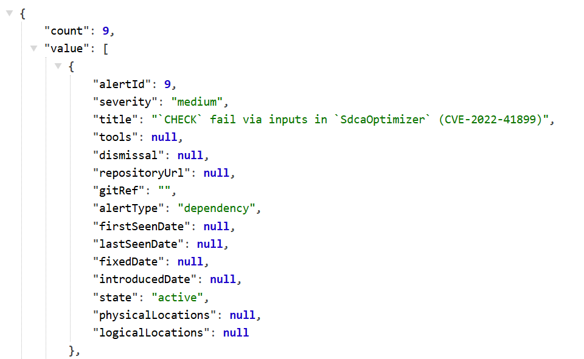

### Advanced Security tracks default branch changes across experiences 

The repository-level alert UX view shows the alert state for your default branch as the initial view, and the security overview displays alert information for your default branch only. We've received feedback that some users often change the default branch for their repositories while the Advanced Security experiences continued showing results for their old default branch selection. 

Now, Advanced Security is aware of changes to your default branch and will update the security overview and repo-level view shortly after your default branch assignment is changed. 

### CodeQL installation for self-hosted agents supports proxy configurations

Automatic CodeQL installation now supports network proxy configurations. Previously, the `enableAutomaticCodeQLInstall` setting could fail when downloading the CodeQL tool cache to self-hosted agents. We've introduced handling for network proxies so that automatic installation runs successfully.

### Alerts branch picker returns all branches with successful scan  

The branch picker in Advanced Security has been updated to display all branches with a successful scan, even if no vulnerabilities are detected. Previously, only branches with alerts were shown, making it difficult to confirm whether a scan completed successfully

Both the repository-level alerts UX and the [Analysis - List API](https://learn.microsoft.com/rest/api/azure/devops/advancedsecurity/analysis/list?view=azure-devops-rest-7.2) now return branches with a successful SARIF submission for dependency and code scanning, improving scan visibility.

### Pull request annotations experience improvements

With this release, we improved the pull request annotation experience in Advanced Security in a few places: 
* Increased dependency scanning annotations: Advanced Security displays pull request annotations even when Advanced Security cannot determine physical file location.
* Auto-closure: pull request comments will be automatically resolved if the associated alert is dismissed. 
We've also introduced performance improvements and batch handling for pull request events for a smoother experience.

### Improvements for Get Alerts API 

With this update we introduce new improvements for the Advanced Security Get alerts API:

* Minimal API expand option: fetch a minimal version of the Alerts API using the parameter `expand=minimal` in your payload. E.g.: `https://advsec.dev.azure.com/{organization}/{project}/_apis/Alert/repositories/{repository}/Alerts?expand=minimal`. 

> [!div class="mx-imgBorder"]
> 

* New metadata for alerts: the Alerts API now returns specific `AdditionalProperties` such as CVE ID or advisory ID for dependency alerts and tags for code scanning alerts. 
* Batched Alert API calls: use `criteria.alertIds={alertId1},{alertId2}` with the Alerts API to receive details for a comma separated list of alert IDs. E.g.:   `https://advsec.dev.azure.com/{organization}/{project}/_apis/Alert/repositories/{repository}/Alerts?criteria.alertIds=100,200,130`.