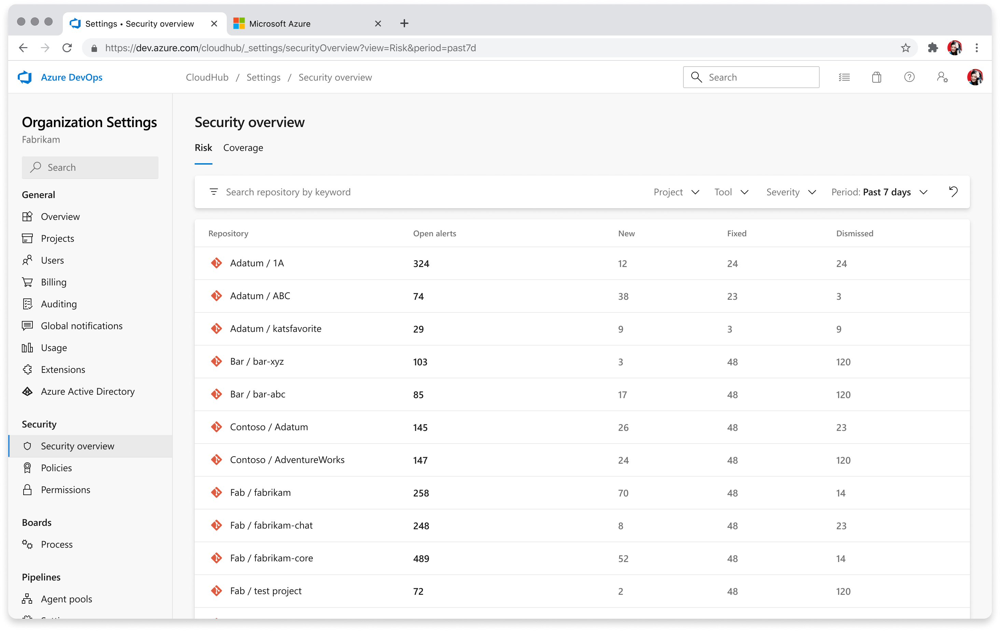

### Security overview risk page enhanced with new columns and filtering options

Under the "Risk" tab, you can now find additional columns for new, fixed, and dismissed security alerts across your organization. We've also added the ability to filter by project, tool (secrets, dependencies, or code scanning results), and a time-based filter to add bounds to your search. 

Additionally, when a filter is applied, it is added as URL query parameter. This is so you can share the pre-filtered view with others in your organization.

> [!div class="mx-imgBorder"]
> 

### pnpm 9 support comes to Advanced Security dependency scanning

Ahead of the end-of-life date for pnpm v8 at the end of April, the next update for dependency scanning will add support for scanning with pnpm v9. This addresses the [Developer Community](https://developercommunity.visualstudio.com/t/AdvancedSecurity-Dependency-Scanning1-T/10743452) request for pnpm v9 support.