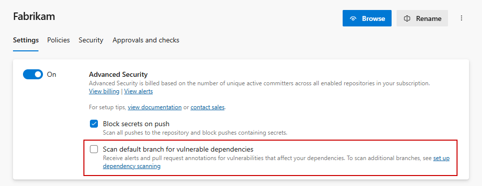
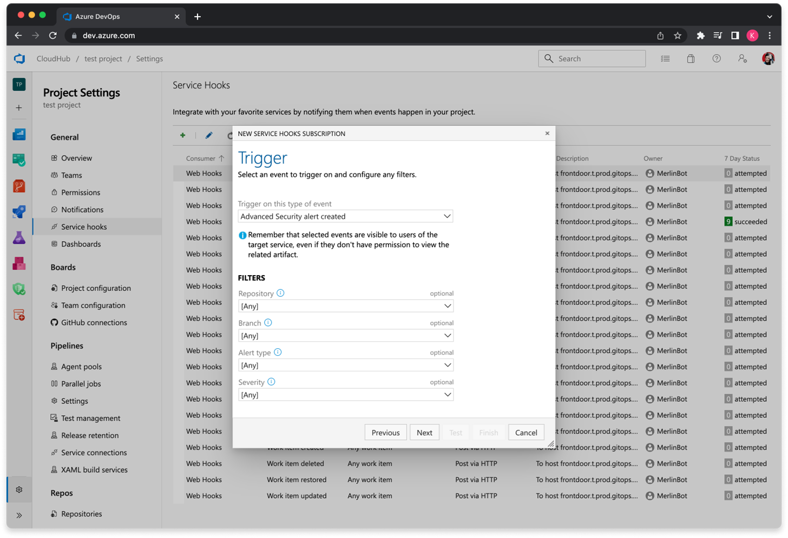

### One click enablement for dependency scanning now in public preview 

From your repository settings, all Advanced Security customers can enable the Advanced Security dependency scanning task without needing to edit your pipeline definition.

By opting in to "Scan default branch for vulnerable dependencies," the dependency task will automatically run in any pipeline targeting your default branch or pull requests targeting your default branch if the task is not already present in your pipeline. If the task is already present in your pipeline, the task will not run again.

> [!div class="mx-imgBorder"]
> 

### Service hooks for GitHub Advanced Security for Azure DevOps alerts generally available

The ability to configure service hooks for GitHub Advanced Security alert events, including:

* New alert created
* Alert data changed
* Alert state changed

are now generally available for use. Just like other repository events, you can filter by repository and branch. For alerts, you can filter by alert type (dependencies, code scanning, or secrets) and alert severity. 

> [!div class="mx-imgBorder"]
> 