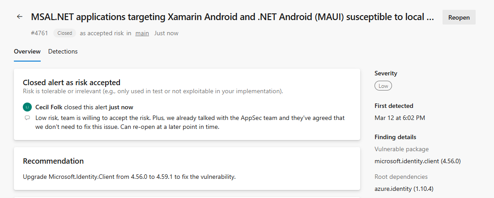

### New secret patterns added to Advanced Security 

New patterns have been added to Advanced Security's Secret Protection for both user alerts and push protection. View the updated list of supported secret patterns at [Secret scanning patterns](/azure/devops/repos/security/github-advanced-security-secret-scan-patterns?view=azure-devops#partner-provider-patterns). 

### Periodic repository re-scans performed for secret scanning 

For any stale repositories, without committing to the repository you may not receive alerts for new or updated secret patterns. To resolve this, we've added periodic, automatic re-scans performed on your behalf to raise new alerts for updated patterns. 

### Dismissals in Advanced Security now available in alert detail UI
Previously, dismissal information was only available via the alerts API. Now, information about the latest dismissal and the user identity shows up in the alert detail view.

> [!div class="mx-imgBorder"]
> 

This address [Developer Community feedback](https://developercommunity.visualstudio.com/t/GHAzDO-closed-security-issues-misses-inf/10930119).