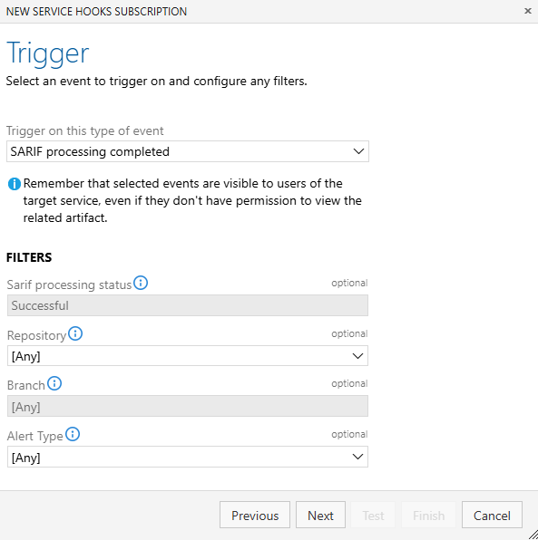

## New SARIF processing completed service hook event

Via the service hooks experience, you can now be notified via service hooks once SARIF processing for Advanced Security build tasks has been complete for your organization or select repositories.

> [!div class="mx-imgBorder"]
> 