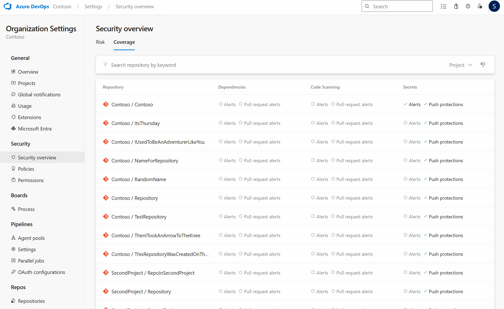
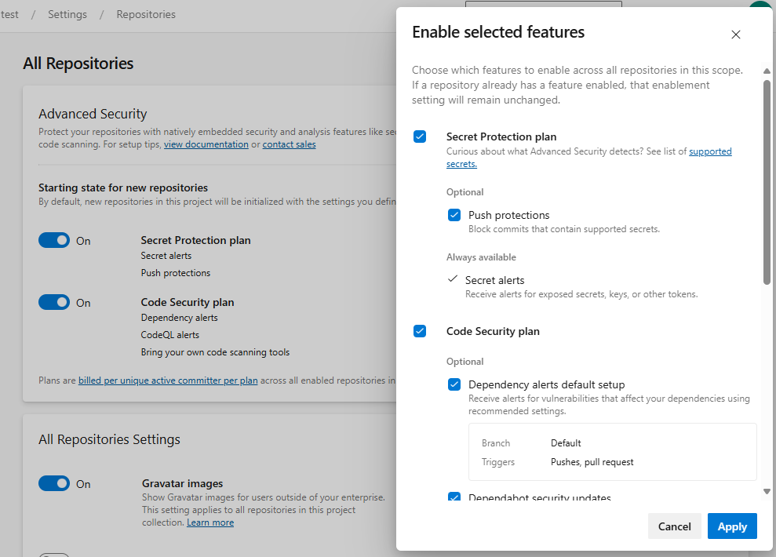

### New state filter available for Coverage in security overview

In addition to the search and project filters, we've also added a new State filter. This allows you to filter by specific enablement states per Advanced Security feature across your organization for increased granularity and improved status monitoring. All filtering changes are also available via API and reflected as URL parameters in your browser.

> [!div class="mx-imgBorder"]
> 

### Enhanced filtering and search capabilities for Coverage

Previously, the security overview Coverage page was a flat list of repositories which was hard to navigate or to find specific enablement statuses. We've added a search bar for keyword search and also a project slicer so you can now filter for enablement status across specific projects. 

> [!div class="mx-imgBorder"]
> 

### Granular enablement panels now available for project and organization-level enablement

Previously, users did not have the ability to modify sub-features at the project or organization-level, such as push protection or dependency scanning auto-injection. These changes now bring the same granular controls you see at the repository level to the project and organization enablement experiences after you select `Enable all`.

> [!div class="mx-imgBorder"]
> 