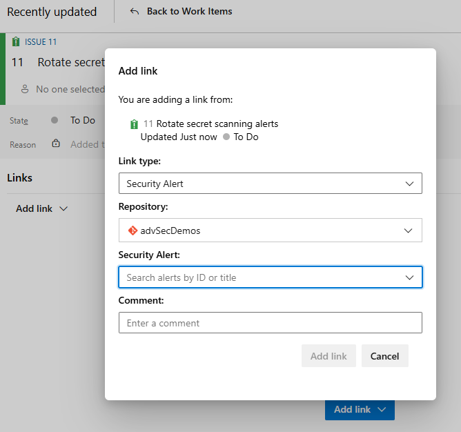
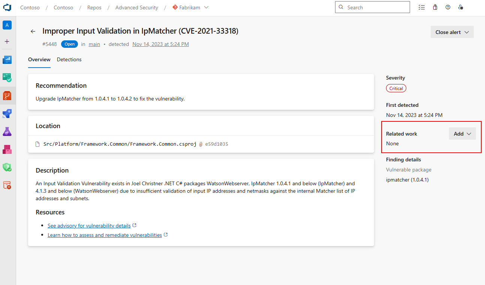
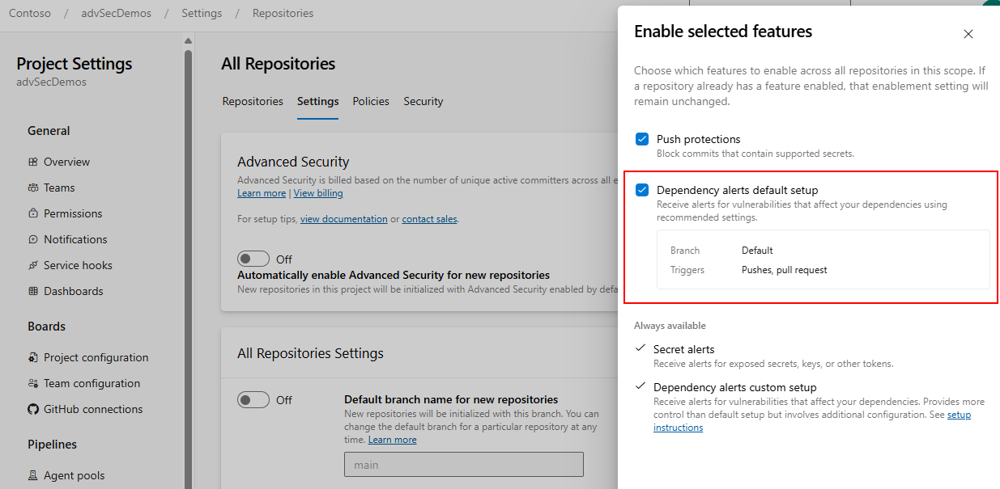

### Work item linking for Advanced Security alerts generally available 

Advanced Security customers can now link work items directly to Advanced Security alerts from your security alerts or from your work items. For more information, see [Link work items to Advanced Security alerts](/azure/devops/boards/backlogs/add-link?view=azure-devops&tabs=browser#link-work-items-to-advanced-security-alerts).

This integration eliminates manual tracking steps, keeping your security and project management tools synchronized.

> [!div class="mx-imgBorder"]
> 

> [!div class="mx-imgBorder"]
> 

### One-click enablement for dependency scanning generally available

Advanced Security customers can now enable dependency scanning directly from repository settings without editing their pipeline. Simply opt in to **Scan default branch for vulnerable dependencies** at the repository level or enable **Dependency alerts default setup** at the project or organization level, and the dependency scanning task will automatically run on any pipeline targeting your default branch and pull requests. 

> [!div class="mx-imgBorder"]
> 

The task intelligently detects if it already exists in your pipeline to prevent duplicate scans.  

Have feedback on this feature or GitHub Advanced Security overall? [Let us know!](https://aka.ms/ghazdo-feedback)

### Resolving throttling for automatic installation of CodeQL toolchain 

Customers utilizing the `enableAutomaticCodeQLInstall` field in `AdvancedSecurity-Codeql-Init@1` may have encountered throttling across agents when attempting to fetch the latest CodeQL version, resulting in task failures. We've made a change to store the CodeQL installation information within the Advanced Security service and limit the number of external calls to prevent future throttling with this setting.