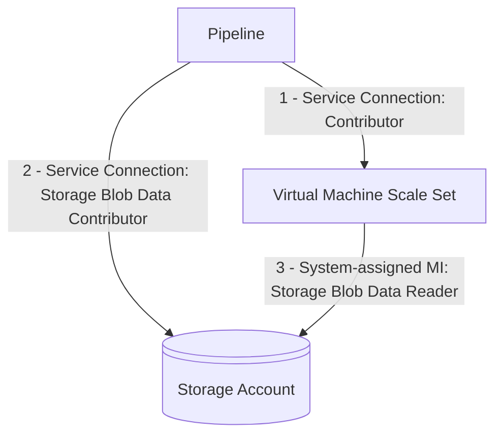

### Ubuntu 24.04


### UseDotNet@2 task uses new CDN

The .NET installer task UseDotNet@2 has been updated to download .NET from the updated CDN location. See blog post [Critical: .NET Install links are changing](https://devblogs.microsoft.com/dotnet/critical-dotnet-install-links-are-changing/).

### Remove Azure Classic


### New AzureVmssDeployment@2, JavaToolInstaller@2, JenkinsDownloadArtifacts@2 tasks secret-less operation

The AzureVmssDeployment, JavaToolInstaller, JenkinsDownloadArtifacts tasks are configured to use Azure Storage:

```yaml
- task: AzureVmssDeployment@1
  inputs:
    (required properties)
    customScriptsStorageAccount: <storage account>
- task: JavaToolInstaller@2
  inputs:
    (required properties)
    jdkSourceOption: 'AzureStorage'
    azureResourceManagerEndpoint: <service connection>
    azureStorageAccountName: <storage account>
- task: JenkinsDownloadArtifacts@2
  inputs:
    (required properties)
    artifactProvider: 'azureStorage'
    ConnectedServiceNameARM: <service connection>
    storageAccountName: <storage account>
```

New task versions have been created that now use Azure RBAC instead of storage account key/sas. The new tasks require the [Storage Blob Data Contributor](https://learn.microsoft.com/azure/role-based-access-control/built-in-roles/storage#storage-blob-data-contributor) role to be assigned to the identity of the service connection configured. The AzureVmssDeployment@1 System-assigned Managed Identity also requires the [Storage Blob Data Reader](https://learn.microsoft.com/azure/role-based-access-control/built-in-roles/storage#storage-blob-data-reader) role:



See [Assign an Azure role for access to blob data](https://learn.microsoft.com/azure/storage/blobs/assign-azure-role-data-access?tabs=portal).