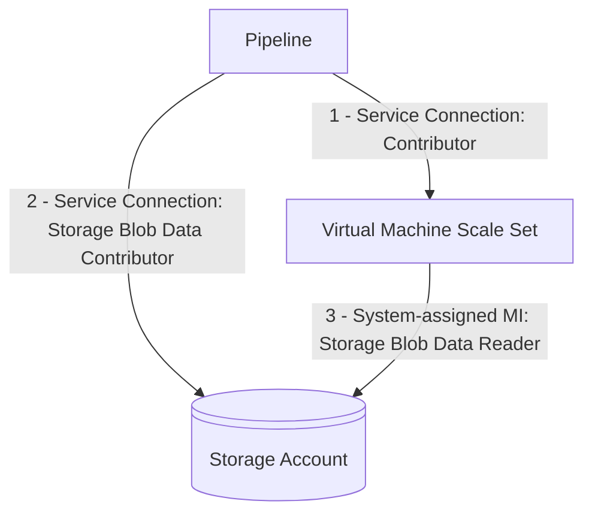

### Azure Classic Service Connections are being retired

Cloud Services is the classic deployment model for Azure, also called Azure Service Manager (ASM). It has been replaced by Azure Resource Manager (ARM) since 2014 and is now [retired](https://azure.microsoft.com/updates?id=cloud-services-retirement-announcement). Therefore, we are removing the ability to create new Azure Classic service connections. Existing Azure Classic service connections will not be removed.

### Managed DevOps Pools is Generally Available

Managed DevOps Pools is an evolution of Azure DevOps Virtual Machine Scale Set agent pools. It provides better pool scalability and reliability, simplifies pool management, and allows you to use the VM images from Microsoft-hosted agents on custom Azure VMs. 

Managed DevOps Pools is now generally available. You can read about Managed DevOps Pools features and the features newly added for GA [here](https://devblogs.microsoft.com/devops/managed-devops-pools-ga/) and [here](https://aka.ms/mdp-docs).


### New AzureVmssDeployment@2, JavaToolInstaller@2, JenkinsDownloadArtifacts@2 tasks secret-less operation

The AzureVmssDeployment, JavaToolInstaller, JenkinsDownloadArtifacts tasks are configured to use Azure Storage:

```yaml
- task: AzureVmssDeployment@1
  inputs:
    (required properties)
    customScriptsStorageAccount: <storage account>
- task: JavaToolInstaller@2
  inputs:
    (required properties)
    jdkSourceOption: 'AzureStorage'
    azureResourceManagerEndpoint: <service connection>
    azureStorageAccountName: <storage account>
- task: JenkinsDownloadArtifacts@2
  inputs:
    (required properties)
    artifactProvider: 'azureStorage'
    ConnectedServiceNameARM: <service connection>
    storageAccountName: <storage account>
```

New task versions have been created that now use Azure RBAC instead of storage account key/sas. The new tasks require the [Storage Blob Data Contributor](https://learn.microsoft.com/azure/role-based-access-control/built-in-roles/storage#storage-blob-data-contributor) role to be assigned to the identity of the service connection configured. The AzureVmssDeployment@1 System-assigned Managed Identity also requires the [Storage Blob Data Reader](https://learn.microsoft.com/azure/role-based-access-control/built-in-roles/storage#storage-blob-data-reader) role:



See [Assign an Azure role for access to blob data](https://learn.microsoft.com/azure/storage/blobs/assign-azure-role-data-access?tabs=portal).