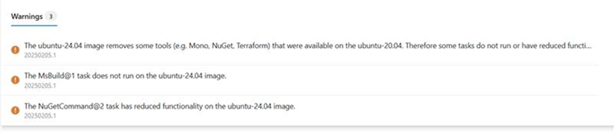
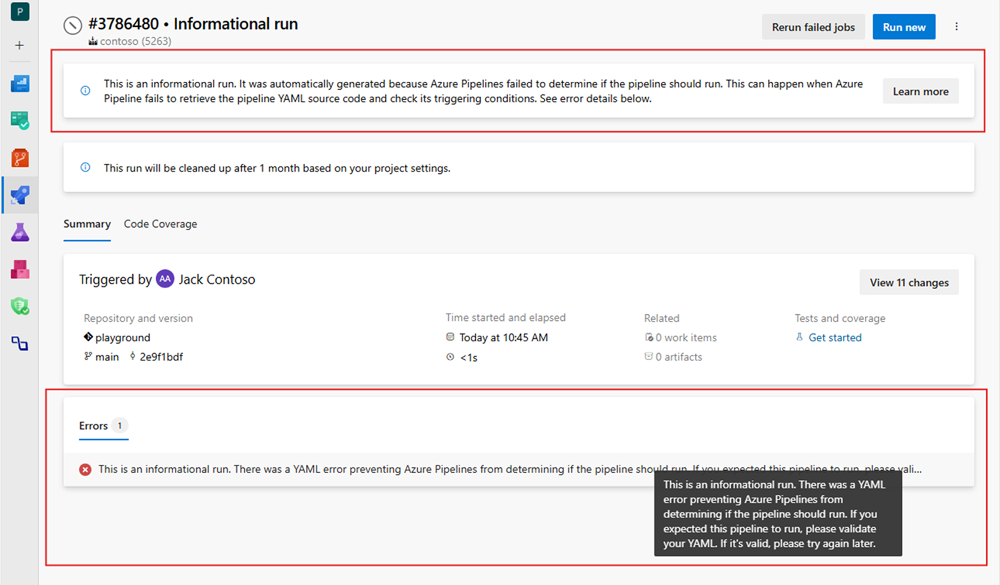

### Pipelines using Ubuntu 24.04 will show warnings for certain tasks

The [Ubuntu 24.04](https://learn.microsoft.com/azure/devops/release-notes/2024/pipelines/sprint-246-update#ubuntu-2404-on-azure-pipelines-hosted-agents) Pipelines image has been in preview since October last year. We plan to update the `ubuntu-latest` image to map to `ubuntu-24.04` in March.

Some tools are no longer available on the Ubuntu 24.04 image:

| Task/Took                             | Description                       |
|---------------------------------------|-----------------------------------|
| `MSBuild@1`                           | Task doesn't work as Mono and MSBuild aren't available for Ubuntu 24. Use native [.NET on Ubuntu](https://learn.microsoft.com/dotnet/core/install/linux-ubuntu) instead. |
| `NuGetCommand@2`                      | Task has reduced functionality as Mono and NuGet aren't available for Ubuntu 24, see instructions on [Migrating to .NET CLI on Ubuntu](/azure/devops/pipelines/tasks/reference/nuget-command-v2?view=azure-pipelines#support-for-newer-ubuntu-hosted-images). |
| Terraform                             | Terraform isn't available on the `ubuntu-24.04` image. You can use the [Terraform extension](https://marketplace.visualstudio.com/items?itemName=ms-devlabs.custom-terraform-tasks) and `TerraformInstaller@1` task to make Terraform available in your pipeline. |

For more information on software differences with the Ubuntu 22.02 image, see [Ubuntu-24.04 image](https://github.com/actions/runner-images/issues/10636).

In preparation of the mapping of `ubuntu-latest` and `ubuntu-24.04`, pipelines using these image labels will show warnings over the coming weeks.

> [!div class="mx-imgBorder"]
> 

### Informational runs

Informational runs tell you Azure Pipelines failed to determine if a pipeline should run or not, because it couldn't process the pipeline's YAML file. Examples of such failures are failures to retrieve the YAML source code or errors in it. 

With this sprint, we're adding support for informational runs for pipelines hosted in Azure Repos. You can see an example below.

> [!div class="mx-imgBorder"]
> 

The pipeline run error tells you the YAML file is incorrect, and this prevents Azure Pipelines from evaluating its trigger conditions.