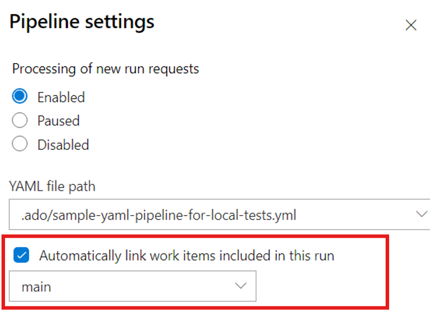

### New Agent CDN

As Edgio CDN is being retired, the domain URL owned by Edgio `https://vstsagentpackage.azureedge.net`&nbsp;will also be retired. We're adding a new domain URL `https://download.agent.dev.azure.com`&nbsp; supported by the new CDN. Be sure to add this new domain URL to your firewall allowlist. Agent package downloads for self-hosted agents will fail once the old domain URL is removed. Refer to the [post](https://devblogs.microsoft.com/devops/?p=70526&amp;preview=1&amp;_ppp=5a164c9044) for more details.


### Node 16 will be removed from pipelines-* Pipeline agent packages

Agent tasks can be implemented in PowerShell or Node. The agent ships with multiple versions of Node that tasks can target.

As new Node versions are released, [tasks](https://github.com/microsoft/azure-pipelines-tasks) are updated to use new Node versions. The runtimes are included with the agent.

As Node versions exit out of the upstream maintenance window, some Pipelines tasks still depend on it. Azure DevOps updates supported tasks to a supported Node version. Third party tasks may still need older Node versions to run.

To accommodate this, we have two types of Pipeline agent [packages](https://github.com/microsoft/azure-pipelines-agent/releases):

| Packages             | Node versions | Description                |
|----------------------|---------------|----------------------------|
| `vsts-agent-*`       | 6, 10, 16, 20 | Includes all Node versions that can be used as task execution handler |
| `pipelines-agents-*` | 20            | Includes only recent Node versions. The goal for these packages is to not include any end-of-life version of Node. |

If you want to run a task that requires the Node 16 execution handler on an agent that doesn't have Node 16 bundled, you can install the execution handler by inserting the [NodeTaskRunnerInstaller@0](https://learn.microsoft.com/azure/devops/pipelines/tasks/reference/node-task-runner-installer-v0?view=azure-pipelines) task in your pipeline:

```yaml
  steps:
  - task: NodeTaskRunnerInstaller@0
    inputs:
      runnerVersion: 16
```

### Improved visibility into YAML Pipeline stage dependencies

YAML pipelines provide flexibility for managing complex workflows, but visualizing stage dependencies has been a challenge—especially in multi-region deployments.

> [!div class="mx-imgBorder"]
> [](../../media/254-pipelines-01.png#lightbox)


In scenarios where stages depend on multiple others, the stage map alone doesn’t offer sufficient clarity. For example, determining whether CUS3 depends on WUS1 in addition to WUS2 and WUS3 has required reviewing the YAML directly.

With this sprint, stage dependencies are now displayed when a stage is expanded, providing immediate insight into execution order and upstream requirements.

> [!div class="mx-imgBorder"]
> [](../../media/254-pipelines-01.png#lightbox)


