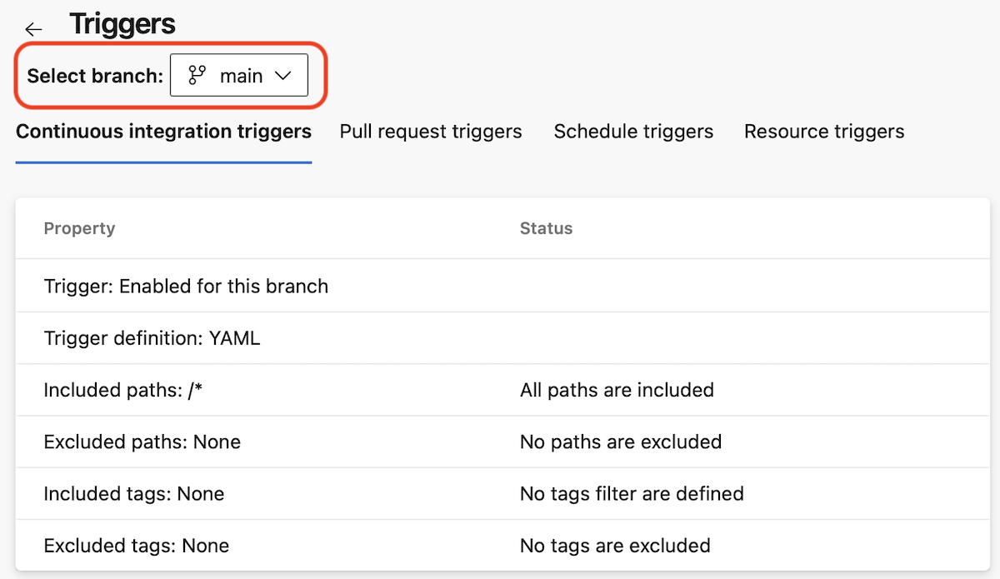
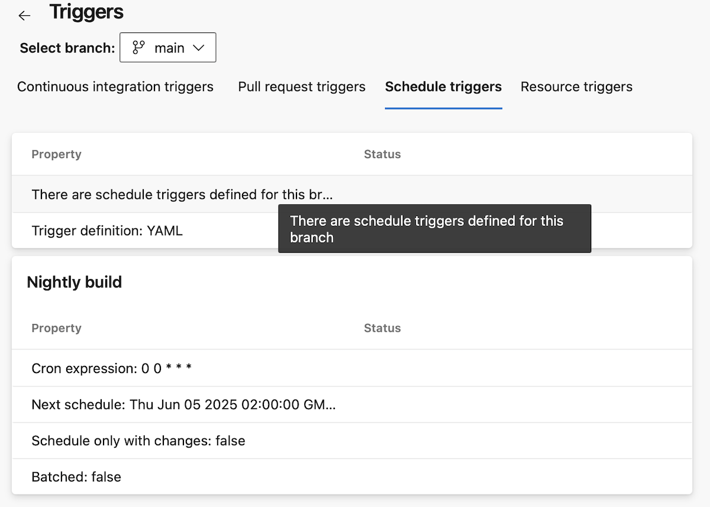
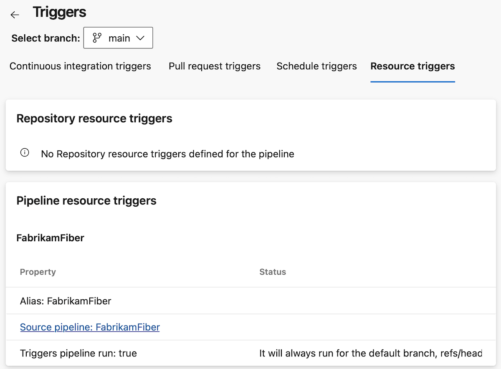
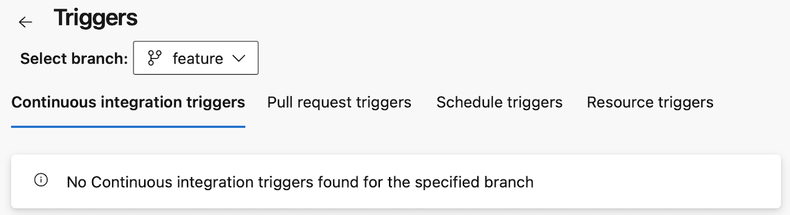
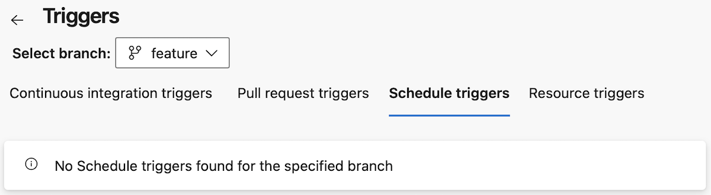
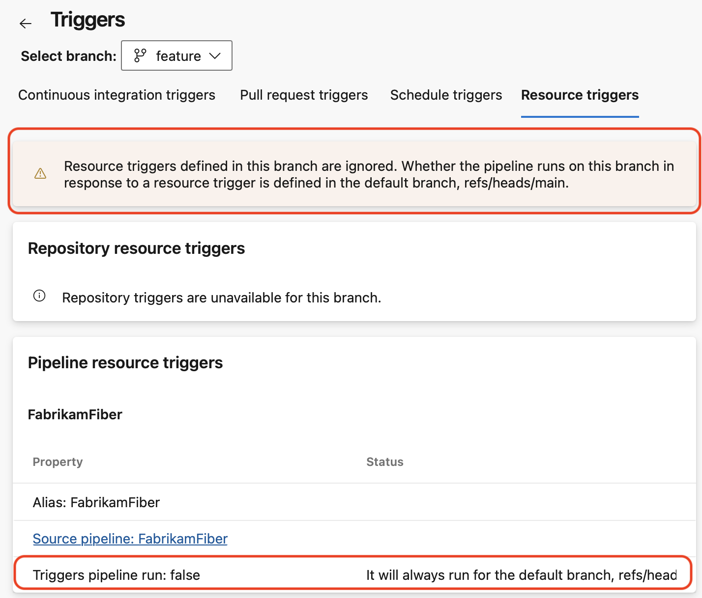
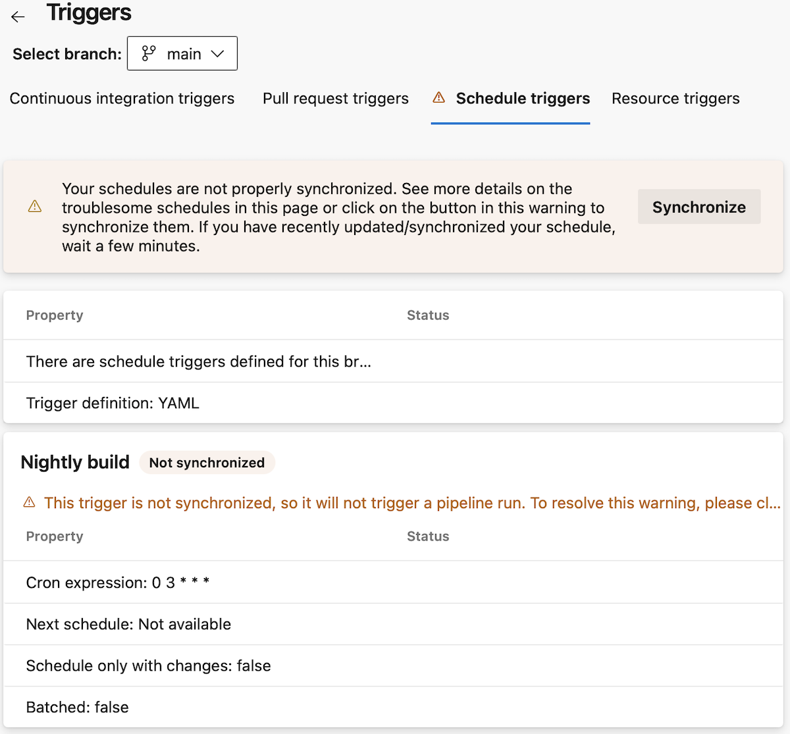
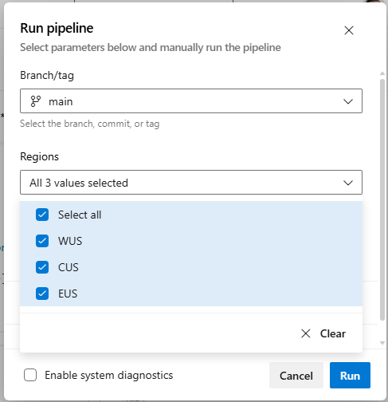
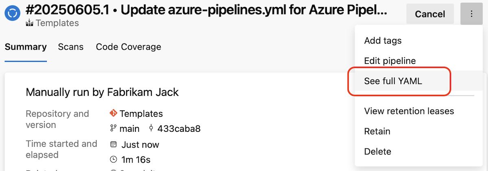

### New Triggers page

YAML pipelines provide you multiple powerful options to define when your pipeline should run. It's not always easy to reason if your pipeline is configured to run in response to an event, for example, a feeder pipeline completed. 

This sprint, were introducing a **Triggers** page that gives you an overview of what triggers you have defined in your pipeline.

> [!div class="mx-imgBorder"]
> [](../../media/257-pipelines-01.png#lightbox)

Imagine you have the following YAML pipeline defined in the `main` branch of a repo. Consider there's also a `feature` branch that has the same YAML pipeline code.

```yaml
trigger:
- main

schedules:
  - cron: 0 0 * * *
    always: true
    displayName: Nightly build
    branches:
      include:
        - main

resources:
  pipelines:
    - pipeline: FabrikamFiber
      source: FabrikamFiber
      trigger: true
```

When you navigate to the **Triggers** page, you see the following

> [!div class="mx-imgBorder"]
> [](../../media/257-pipelines-02.png#lightbox)

Notice the default branch of the pipeline, `main`, is preselected. 

You see there is a _Continuous integration trigger_ for this branch, and it's defined in the YAML file.

When you navigate to the _Schedule triggers_, you see there are triggers defined, and you can see their details.

> [!div class="mx-imgBorder"]
> [](../../media/257-pipelines-03.png#lightbox)

When you navigate to the _Resource triggers_ section, you see the defined resource triggers and their details.

> [!div class="mx-imgBorder"]
> [](../../media/257-pipelines-04.png#lightbox)

You can switch branches, from `main` to `feature`, to see what triggers you defined for the `feature` branch.

> [!div class="mx-imgBorder"]
> [](../../media/257-pipelines-05.png#lightbox)

> [!div class="mx-imgBorder"]
> [](../../media/257-pipelines-06.png#lightbox)

> [!div class="mx-imgBorder"]
> [](../../media/257-pipelines-07.png#lightbox)

In the _Resource triggers_ tab, when not on the default branch, you get a warning telling you the triggers defined for this branch are ignored.

When trigger definitions were not correctly processed by the system, you get a warning and indications on how to solve the problem.

> [!div class="mx-imgBorder"]
> [](../../media/257-pipelines-07.png#lightbox)

### StringList parameter type

One of the top requested YAML pipelines features in the Developer Community is to [define parameters that contain a list of items](https://developercommunity.visualstudio.com/t/parameters-that-support-multiselect/1224839).

Starting with this sprint, we've added a new parameter type, named `StringList`, that provides this capability.

Say you want to allow those who queue pipeline runs to choose which regions they want to deploy a payload to. Now you can do this as shown in the example below.

```yaml
parameters:
- name: regions
  type: stringList
  displayName: Regions
  values:
    - WUS
    - CUS
    - EUS
  default: 
    - WUS
    - CUS
    - EUS 

stages:
- ${{ each stage in parameters.regions}}:
  - stage: ${{stage}}
    displayName: Deploy to ${{stage}}
    jobs:
    - job:
      steps:
      - script: ./deploy ${{stage}}
```

When queuing this pipeline, you have the option of choosing multiple regions to deploy to, as shown in the following screenshot.

> [!div class="mx-imgBorder"]
> [](../../media/257-pipelines-08.png#lightbox)

### See the full YAML code of a pipeline run

YAML pipelines are composable. You may extend a template, to ensure your pipelines runs the necessary static analysis tools, and include templates to run common stages or jobs or tasks.

Debugging such pipelines was not easy, because you couldn't see the full YAML code it was running.

Say you have the following pipeline:
```yaml
parameters:
- name: PoolName
  type: string
  default: Azure Pipelines
- name: VmImage
  type: string
  default: ubuntu latest

extends:
  template: security-enforcing-template.yml
  parameters:
    jobs:
    - template: job.monitoring.yml
    - template: job.build.yml
      parameters:
        PoolName: ${{parameters.PoolName}}
        VmImage: ${{parameters.VmImage}}
```

There are three templates used here. Each template may use conditional expressions based on parameter and variable values to determine the actual jobs or steps to run.

Furthermore, when looking at old pipeline runs, you don't know if the pipeline's code is the same now as when the run ran. 

In this sprint, we're adding a new functionality that allows you to easily see the full YAML code of a pipeline run.

> [!div class="mx-imgBorder"]
> [](../../media/257-pipelines-10.png#lightbox)
