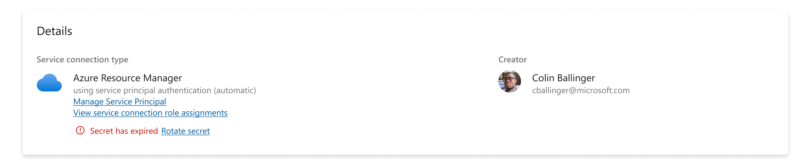
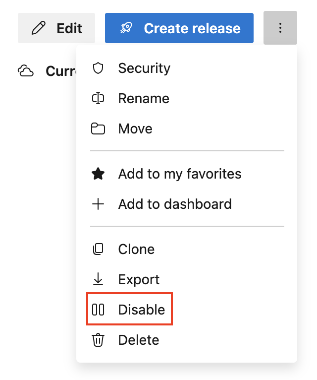

### Improved secret rotation support for Azure service connection  

For service connections that use a service principal with a secret, we already let you rotate the secret by updating the service connection. This was not explicitly conveyed in the configuration experience though.
We have updated the experience of the Azure service connection to detect secret expiration and offer to rotate the secret:

> [!div class="mx-imgBorder"]
> 

### AzureAppServiceManageV0 Versioned Extension Support (preview) 

You can now specify App Service extensions as `name@version` (e.g., `PythonExtension@3.9.0`). If a version is specified, that exact version will be installed. If you specify `latest` as the version, the latest available version will be installed (in case it already has the latest version, installation will be skipped). If no version is specified, the extension will only be installed if it is not already present.  
Examples: `MyExtension@1.2.3, OtherExtension@latest, LegacyExtension`.

### Ability to disable release pipelines

Release pipelines can now be disabled. This can be useful if a pipeline is no longer used or not expected to be used again. Disabled release pipelines can be re-enabled.

> [!div class="mx-imgBorder"]
> 