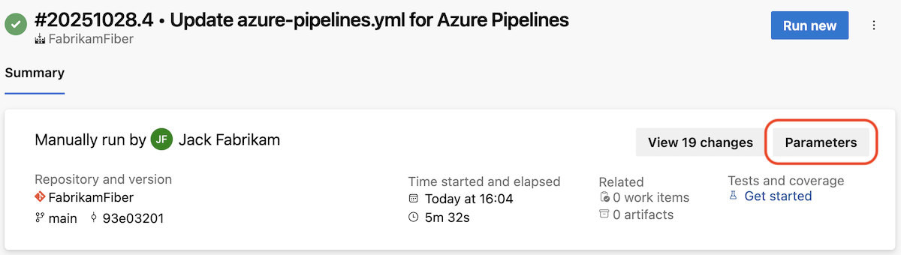
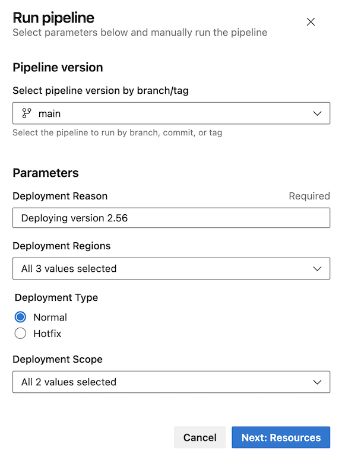
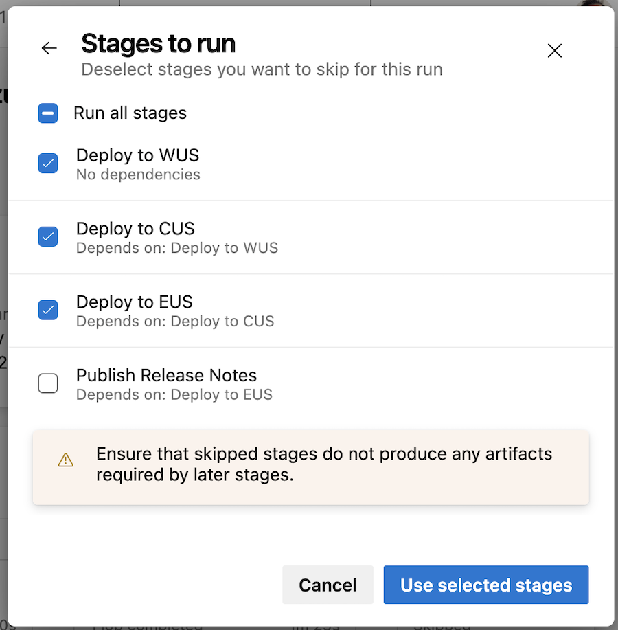
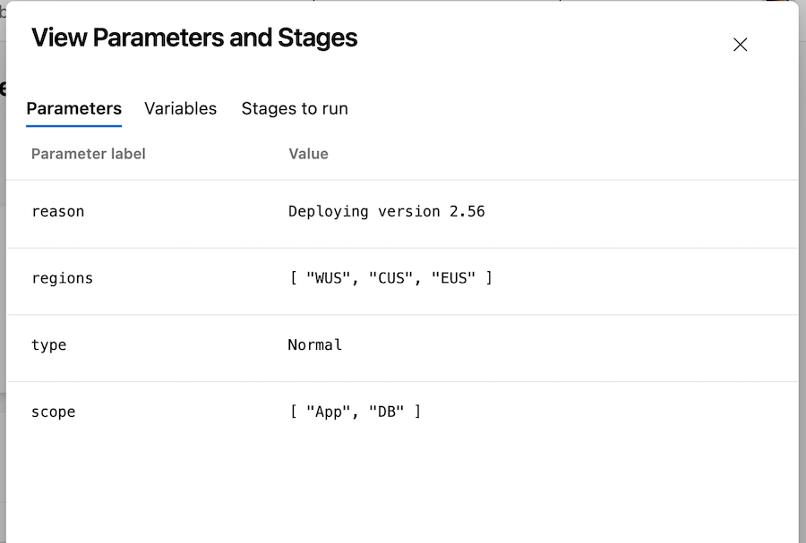
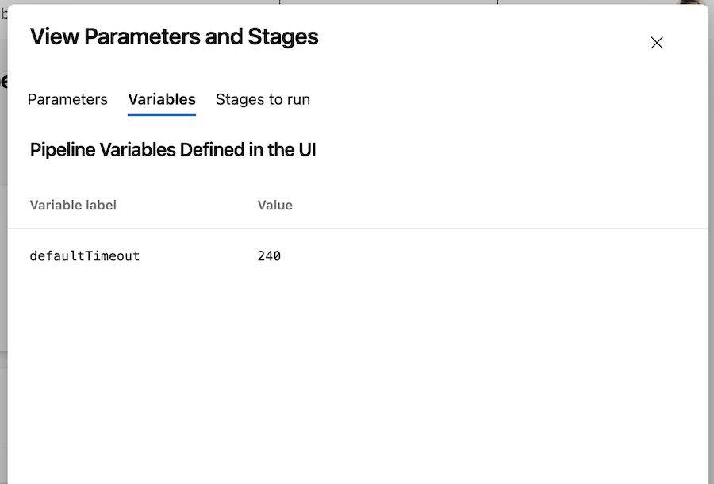

### Reduce authorization timeout

Before a YAML pipeline run can access a protectable resource for the first time, such as a service connection or an agent pool, authorization is required. During the authorization process, runs are paused, which may result in many runs being temporarily halted. Once authorization is granted, all paused runs resume, which can occasionally lead to unintended effects.

To limit the number of resumed runs, we’re reducing the authorization timeout from 30 days to 7 days. Runs that are already blocked and waiting for authorization will not be affected by this change. In some cases, blocked runs may display UI irregularities, including negative timeouts.

### Pipeline Parameters

When inspecting or debugging a deployment pipeline run, understanding the run’s inputs is essential. This information provides clarity on the pipeline’s behavior and helps explain the purpose of the run.

In this sprint, we've added a new _Parameters_ panel.

> [!div class="mx-imgBorder"]
> 

The panel’s information is populated as follows:

* Imagine initiating a pipeline run using the following parameters. 

> [!div class="mx-imgBorder"]
> 

* Additionally, we change the value of a variable named _defaultTimeout_ to 240, and deselect the last stage.

> [!div class="mx-imgBorder"]
> 

* The _Parameters_ panel shows you the values of the pipeline parameters, the (non-secret) variables defined in the UI, and the selected stages.

Parameter values: 

> [!div class="mx-imgBorder"]
> 

Variables defined in the UI: 

> [!div class="mx-imgBorder"]
> 

Selected stages:

> [!div class="mx-imgBorder"]
> 