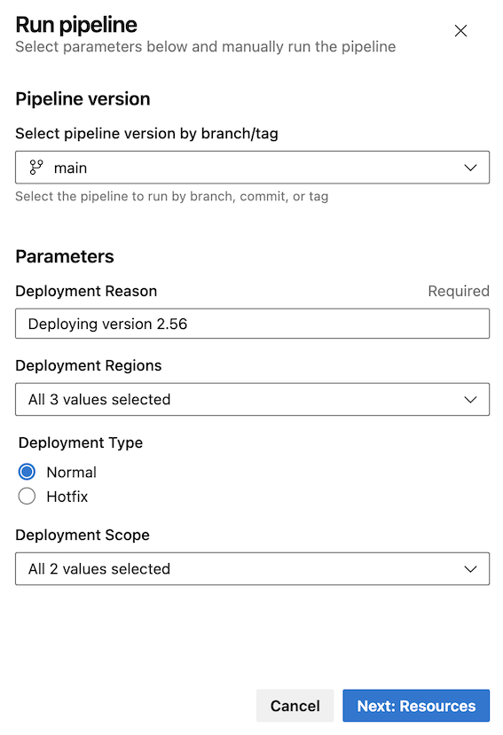
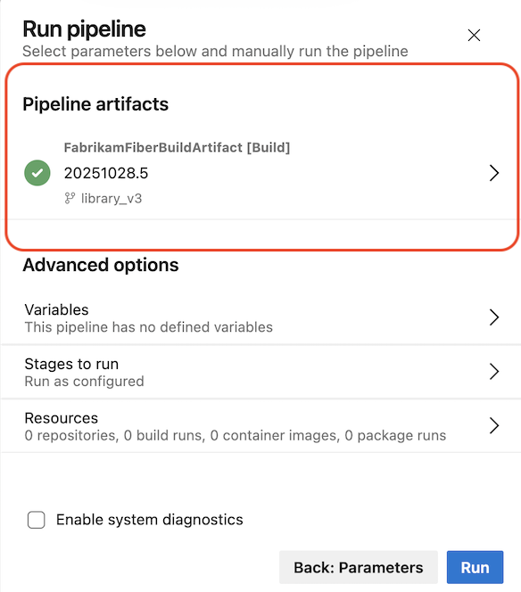
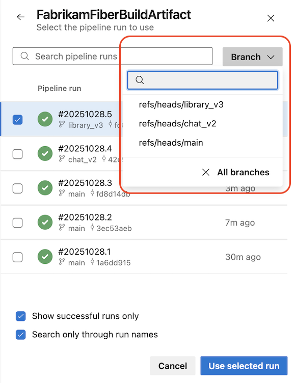
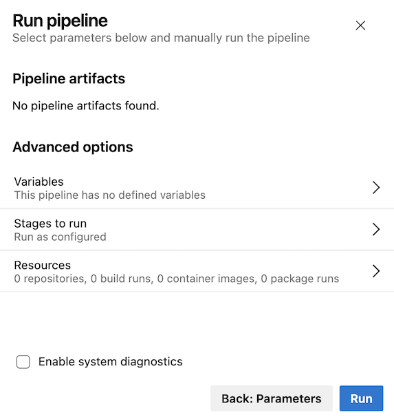
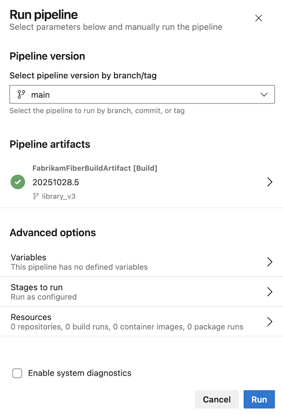
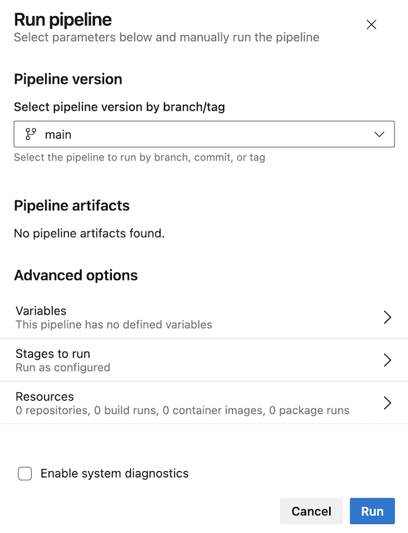

### New Run Pipeline Panel  

In this sprint, we've improved the security and experience of using YAML pipelines for continuous deployment (CD) scenarios. Previously, managing the pipeline artifact to deploy was tedious and error prone. It wasn't clear which run you were going to deploy by default. If you wanted to change the artifact, you couldn't select by run branch.  

* Fist, the new panel lets you fill in parameters, as they may determine which pipeline artifact to deploy.  

> [!div class="mx-imgBorder"]
> 

* After you click on **Next:Resources**, you will see which pipeline artifact has been chosen. This way, you are sure of what you're going to deploy.  

> [!div class="mx-imgBorder"]
> 

* If you want to change the pipeline artifact, you can use the **Branch** selector to narrow down your search.  

> [!div class="mx-imgBorder"]
> 

* When your pipeline defines parameters but doesn't use any artifacts, the UI will let you know that no pipeline artifacts were found.

> [!div class="mx-imgBorder"]
> 

* When your pipeline doesn't define parameters, the **Run pipeline** panel is one step, similar to today.  

This is how it looks when the pipeline uses pipeline artifacts.

> [!div class="mx-imgBorder"]
> 

And this is how it looks when your pipeline doesn't use pipeline artifacts.

> [!div class="mx-imgBorder"]
> 