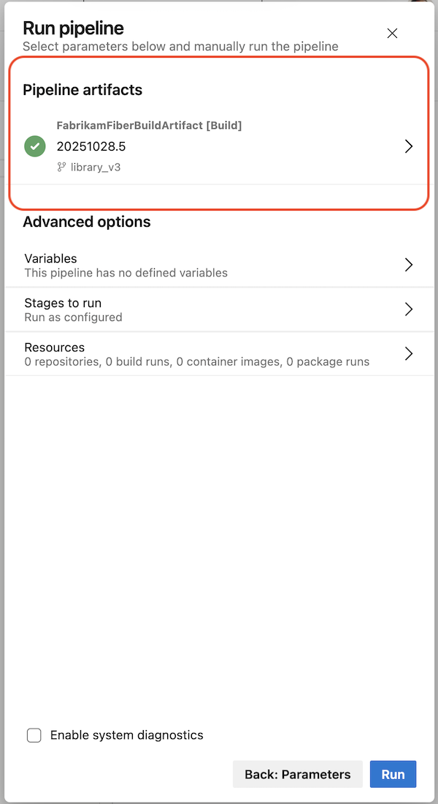
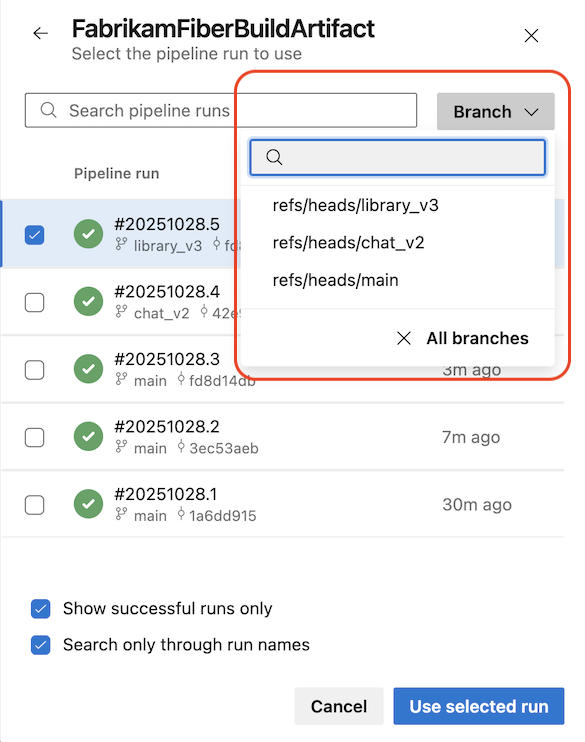
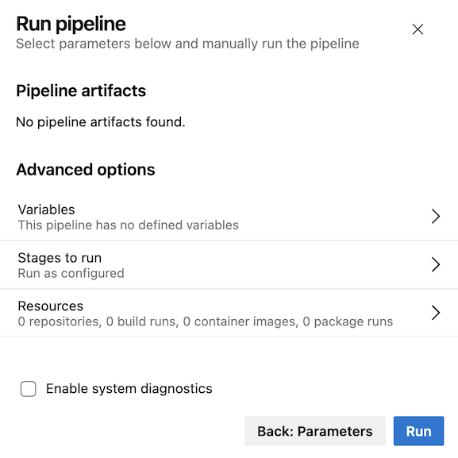
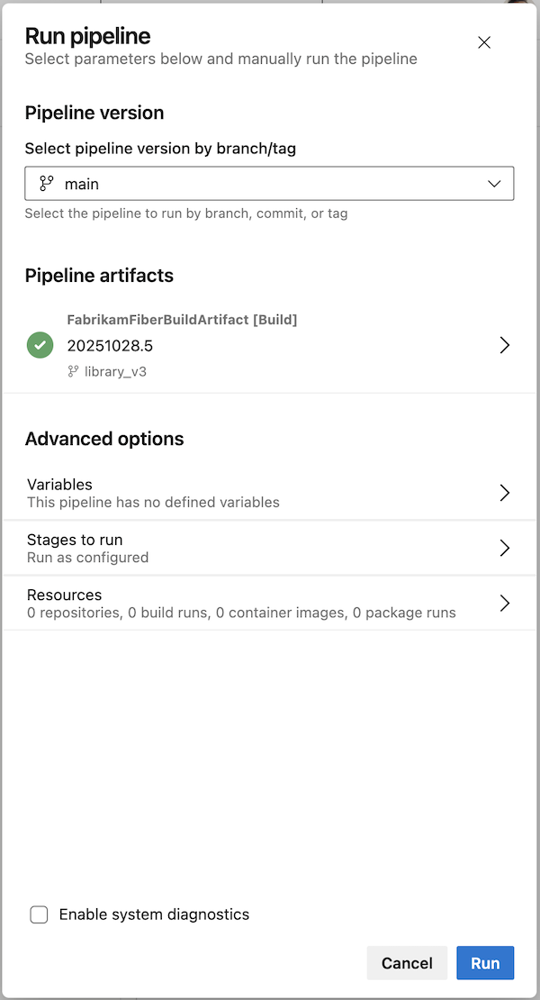
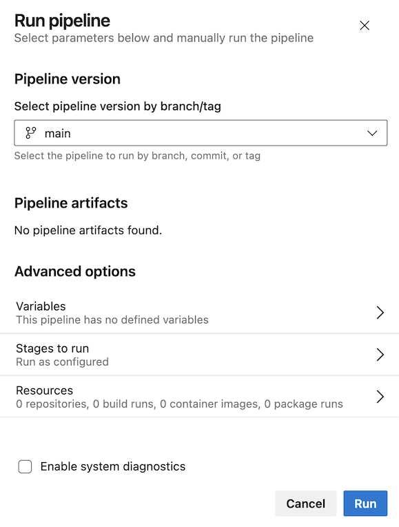

### Clearer artifact selection for YAML CD deployments  

In this sprint, we enhanced the security and deployment experience for YAML pipelines in CD scenarios.  

Previously, managing the pipeline artifact to deploy was tedious and error‑prone. It wasn’t always clear which run would be deployed by default, and selecting a different artifact such as by run branch was not supported.

The updated deployment panel now guides you to configure parameters first, ensuring they are applied before determining the pipeline artifact to deploy. This reduces deployment errors and makes artifact selection more predictable and secure.

> [!div class="mx-imgBorder"]
> 

After selecting **Next: Resources**, the deployment panel clearly shows which pipeline artifact has been selected, giving confidence in exactly what will be deployed.  

> [!div class="mx-imgBorder"]
> 

If you want to change the pipeline artifact, you can use the branch selector to narrow down your search.  

> [!div class="mx-imgBorder"]
> 

When a pipeline defines parameters but does not use pipeline artifacts, the UI clearly indicates this to avoid confusion.

> [!div class="mx-imgBorder"]
> 

When your pipeline doesn’t define parameters, the Run pipeline panel remains consistent with the current experience. When the pipeline uses pipeline artifacts, the updated panel reflects that flow, as shown below.

> [!div class="mx-imgBorder"]
> 

Here’s how the experience looks when your pipeline doesn’t use pipeline artifacts.

> [!div class="mx-imgBorder"]
> 