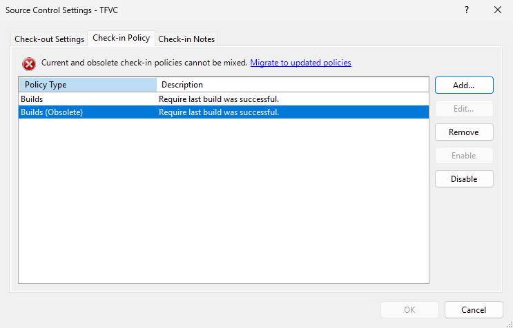

### TFVC check-in policies changes

## New version (19.254) of Microsoft.TeamFoundationServer.ExtendedClient NuGet package
NuGet `Microsoft.TeamFoundationServer.ExtendedClient` package was updated with new TFVC policy classes and methods.


## TFVC check-in policies changes

We are changing the way TFVC policies are stored on Azure DevOps side, which also means we are updating how NuGet Microsoft.TeamFoundationServer.ExtendedClient communicates with the service. 


TFVC projects using check-in policies need to perform migration of the policies to the new format. There are two ways how to approach the migration:

1.    Using Visual Studio.

     Warning: Please ensure you updated Visual Studio to the latest version before proceeding (VS 2022, VS 2019 and VS 2017 with minimal versions `17.14 Preview 3`, `17.13.6`, `17.12.7`, `17.10.13`, `17.8.20`, `16.11.46`, `15.9.72` are supporting the new policies).

To create new policies using Visual Studio project administrator should open Settings -> Team Project -> Source Control -> Check-in Policy and add new policy (without “Obsolete” mark) with the same parameters as old one:

> [!div class="mx-imgBorder"]
> [](../../media/254-repos-01.png#lightbox)

2.     If you are using custom implementation of `Microsoft.TeamFoundationServer.ExtendedClient` to communicate with server, please follow the [migration guide]().


The migration is required for keeping TFVC check-in compatible with the future Azure DevOps versions. For the time being, both old (Obsolete) as well as new policies remain valid and functionable.
For information on the Future Plans, please see our [blog post](https://devblogs.microsoft.com/devops/?p=70556&preview=true).


### Enhancement to GetRepository API

We have added `creationDate` property to the response of Repositories - Get Repository API returning repository creation date. The property is available on the API versions `7.2-preview` and higher.

## Enhancement to Pull Requests Query API

We have introduced a new `Label` property in the response of Pull Request Query - Get API. You can now specify whether to include labels (tags) for related pull requests in every query.
A new `Include` property is available - if set to Labels, the response will include labels for the specified PRs.
If left as `null`, labels will not be included.
To prevent unintended errors, ensure that `NotSet` is not explicitly assigned - this will result in `Bad Request`.
Please note that label enrichment resource utilization depends on the number of assigned labels and their length. Requesting labels can impact throttling and increase network load. To optimize the performance, we recommend avoiding unnecessary label requests.

Request payload example
```json
{
    "queries": [
        {
            "type": "lastMergeCommit",
            "include": "Labels",
            "items": [ 
                "0d6c9b2b524113113fced41aecbf8631a4649dec"
            ]
        },
        {
            "type": "lastMergeCommit",
            "items": [
                "b524113113f0dd41aecbf8631a4649dec6c9b2ce"
            ]
        }
    ]
}
```