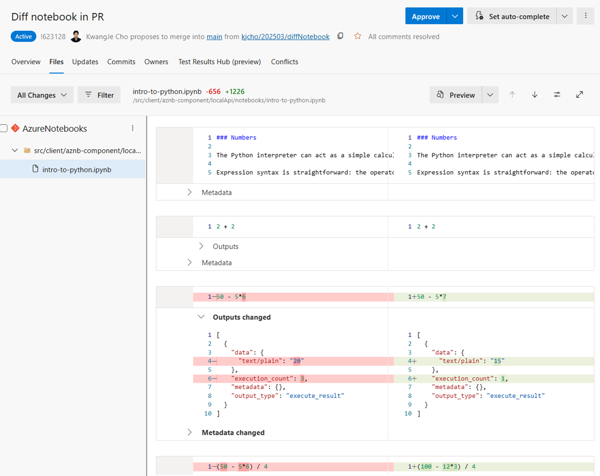

### Support for Jupyter Notebook diffing in PR

In response to customer feedback, we’ve added support for diffing .ipynb files in PRs in the Jupyter Notebook extension. Instead of parsing raw JSON, you’ll now get a side-by-side notebook view that highlights changes in code and Markdown cells. Outputs and metadata are shown in collapsible sections, and any changes in those sections are marked in bold.

> [!div class="mx-imgBorder"]
> 