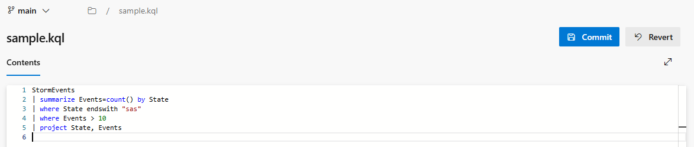

### Syntax highlighting support for Kusto Query Language 

Azure DevOps now supports syntax highlighting for Kusto Query Language in the file view and edit experience. This enhancement applies to files with `.csl`, `.kql`, and `.kusto` extensions, making it easier to read and edit KQL scripts directly within the platform.

> [!div class="mx-imgBorder"]
> 