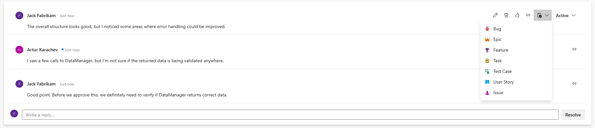

### Create work items from pull request comments

You can now create a work item directly from a comment in your pull request. Simply open a PR, add a comment, and click the new **Create Work Item** button. Then, choose the desired work item type from the dropdown menu.

> [!div class="mx-imgBorder"]
> 

### Enhanced diagram support in wiki pages and file preview

We brought expanded support for a variety of Mermaid diagram types and visualizations, enhancing your documentation and project planning capabilities. The newly supported diagram types that we have included this sprint are: Entity relationship and Timeline diagram.

You can find more information about Mermaid support in the [work with Mermaid diagrams documentation](/azure/devops/project/wiki/markdown-guidance?view=azure-devops#work-with-mermaid-diagrams)