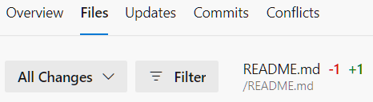
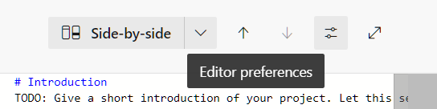
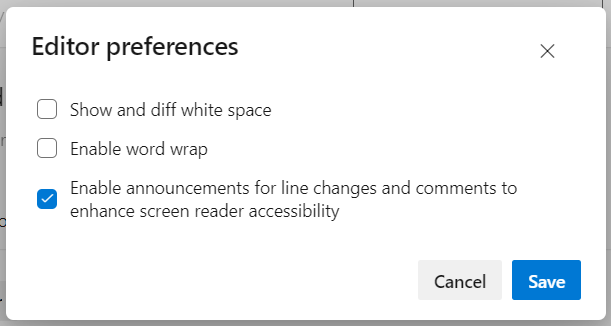

### Improved screen reader support for pull request experience

We improved support for screen readers in Pull Request experience.
The new option in built-in code editor will allow to enable announcements for line changes and comments.

To enable new option, on Pull Request page click "File" tab:

> [!div class="mx-imgBorder"]
>  

After that, click on "Editor preferences" button:

> [!div class="mx-imgBorder"]
> 

In opened popup menu enable "Enable announcements for line changes and comments to enhance screen reader accessibility" option and click on "Save" button:

> [!div class="mx-imgBorder"]
> 