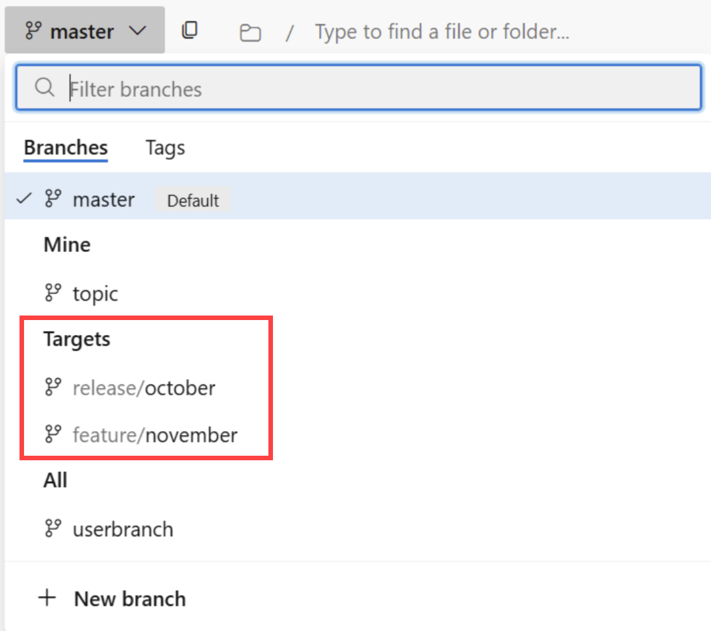

### Required upgrade of TFVC Proxy when used with hosted (cloud) TFVC repositories
  
Due to security enhancements, customers using a TFVC Proxy for TFVC repositories hosted in Azure DevOps Services (cloud) are required to upgrade their TFVC Proxies to [Azure DevOps Server 2022.2 Patch 7](/azure/devops/server/release-notes/azuredevops2022u2?view=azure-devops#azure-devops-server-2022-update-2-patch-7-release-date-november-11-2025) or later. Once [Azure DevOps Server RTW](/azure/devops/server/release-notes/azuredevopsserver?view=azure-devops) is available, its Proxy will also be compatible with Azure DevOps Services.

Other TFVC scenarios (usage without a Proxy, or usage with a Proxy for Azure DevOps Server/on-premises) do not require any changes.

### Improved comment navigation by the link in pull requests

We’ve improved the behavior of comment navigation within the pull request experience. When accessing a specific comment via a direct link, the system now handles focus better for pull requests with a large number of comments.

### Target branches now available in pull request branch dropdown

Customers using [Pull Request Targets](/azure/devops/repos/git/pull-request-targets) will now have their target branches highlighted in the new **Targets** section in the branch dropdown, appearing between the **Mine** and **All** section.

>> [!div class="mx-imgBorder"]
> 

Visit the [configure target branches for pull requests documentation](/azure/devops/repos/git/pull-request-targets?view=azure-devops) to learn how to get started with target branches.
