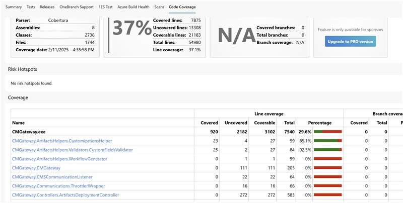

### Improvements on the Publish code coverage results v2 task

This release contains a few improvements to the v2 task:
* Support for a wide range of code coverage formats, including .coverage, .covx, .covb, .cjson, .xml, .lcov, and pycov1.
* Generation of a comprehensive cjson file (and a Code Coverage report) that contains detailed code coverage information such as file names, lines covered/not covered, etc.

> [!div class="mx-imgBorder"]
> 

* Support for diff coverage (PR coverage): V2 can generate diff coverage PR comments for multiple languages within the same pipeline.
* V2 now supports the Build Quality Check task, which was not supported in V1.

### Default resume for paused test case

Quickly resume your paused test cases with a single click. We've made "Resume" the default action for paused test cases, allowing you to pick up right where you left off without extra navigation. This update makes it faster and easier to continue your work without interruption. To further protect your progress, we're introducing a confirmation prompt to prevent accidental overwrites of paused test progress. This safeguard ensures your partially saved work stays intact, giving you peace of mind while managing your test runs. Give it a try and let us know via email what you think!

### Export test cases with custom columns in XLSX

Now export test cases with custom columns in XLSX. Based on your feedback, Test Plans supports exporting test cases with custom columns, giving you greater flexibility and control over the data you share and analyze. This enhancement helps you tailor exports to your needs, ensuring the information you export is relevant and actionable.