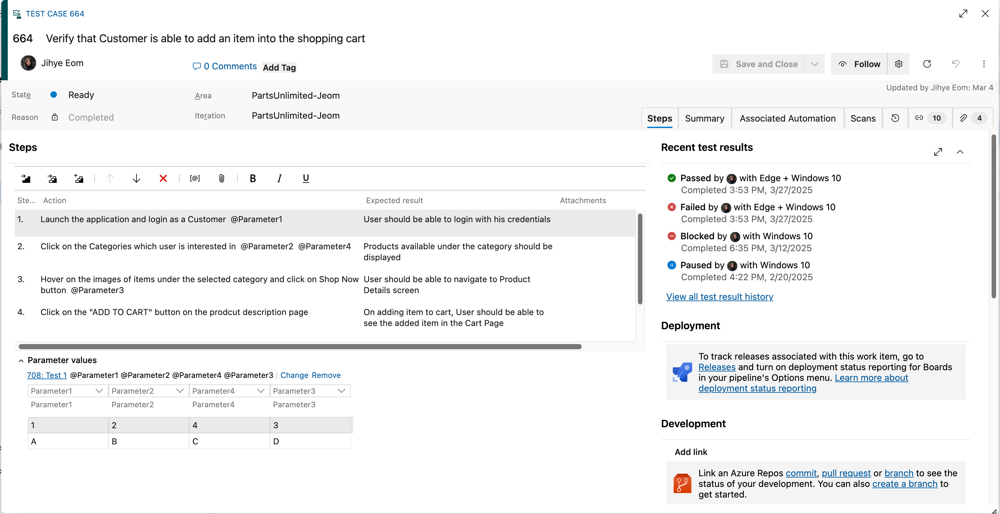

### Switch to Screen Recording as Action Logging is Being Retired

Our desktop Azure Test Runner client relies on Problem Steps Recorder (PSR), a tool introduced in Windows 7 that is now being deprecated in newer Windows versions. As a result, the action log functionality in our desktop test runner may no longer work in future updates. 

To ensure uninterrupted test tracking, we recommend switching to screen recording in our web runner, Test & Feedback Extension, which provides a modern, reliable way to capture and manage test steps. If you need assistance transitioning to the Test & Feedback Extension, please feel free to reach out to our support team.

### Quick Access to Test Results in Test Case 

You can now quickly access recent test case results directly from the test case work item, making it easier to track progress and stay on top of your testing efforts without navigating through test plans or suites.

We’ve added a new “Recent Test Results” section that displays the top 4 most recent test runs. Each entry includes key information at a glance:

* **Test outcome** (e.g., Passed, Failed) 
* **Run by** (the user who executed the test) 
* **Configuration** of the associated test point 
* **Completed** date of the result 

For deeper analysis, a direct link to the full execution history is also available, allowing you to access all past results for the test case in one place. 

These enhancements are designed to streamline your workflow, improve traceability, and help you quickly find the insights you need. Give it a try and let us know via [email](mailto:adocustomerfeedback@service.microsoft.com) what you think!

> [!div class="mx-imgBorder"]
> 