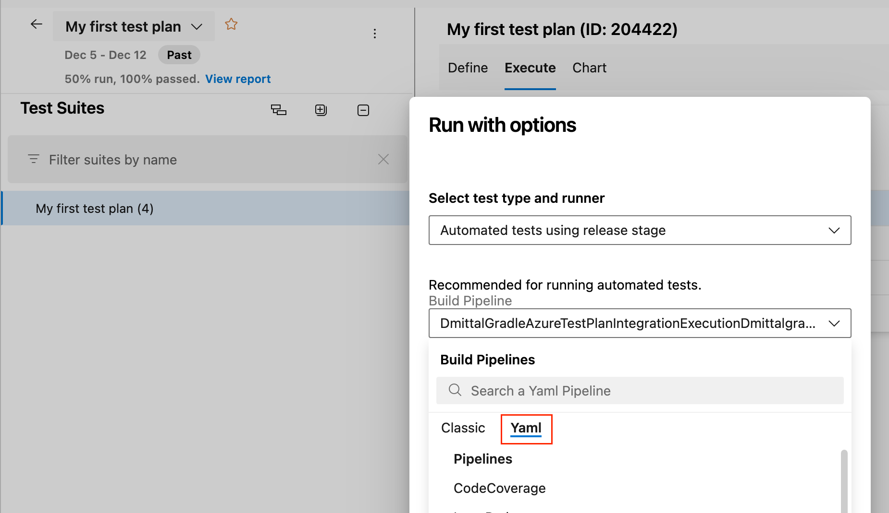
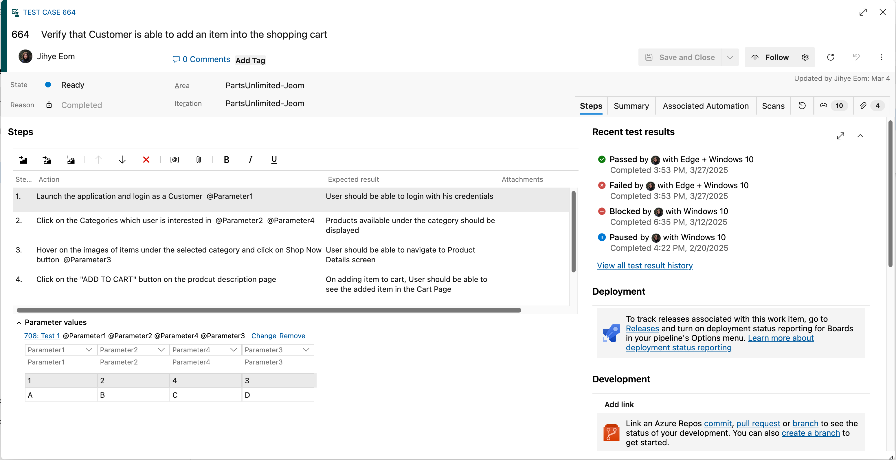

### Support for YAML pipelines in Test Plans

> [!NOTE]
> **Updated June 26,2025:** We’ve temporarily disabled this feature due to a bug and are working to resolve it as quickly as possible. We will share additional updates in this article as soon as the issue is resolved. 

In addition to Classic pipelines, you can now use your YAML pipelines when configuring your Test Plans or executing automated tests from Test Plans.

This request was prioritized based on the following Developer Community suggestion tickets. 
* [Allow YAML pipeline to use in test plan settings](https://developercommunity.visualstudio.com/t/Allow-YAML-pipeline-to-use-in-test-plan-/10469981)
* [Run automated tests from Azure Test Plans using YAML pipeline](https://developercommunity.visualstudio.com/t/Run-automated-tests-from-Azure-Test-Plan/10002983)

> [!div class="mx-imgBorder"]
> 

### View recent test results in Test Case

We’ve added a new **Recent test results** section to the test case work item, making it easier to monitor test progress without switching views or navigating through test plans. 

With this update, you can: 

* View the top 4 most recent test results directly from the test case 
* See key details at a glance: outcome, run by, configuration, and completed date 
* Access the full execution history in one click for deeper analysis 

> [!div class="mx-imgBorder"]
> 
These enhancements streamline test review and support requirement-based traceability by keeping execution insights close to where your test cases live. This feature will roll out gradually and become available in the coming weeks. Give it a try, and let us know via [email](mailto:adocustomerfeedback@service.microsoft.com) what you think!