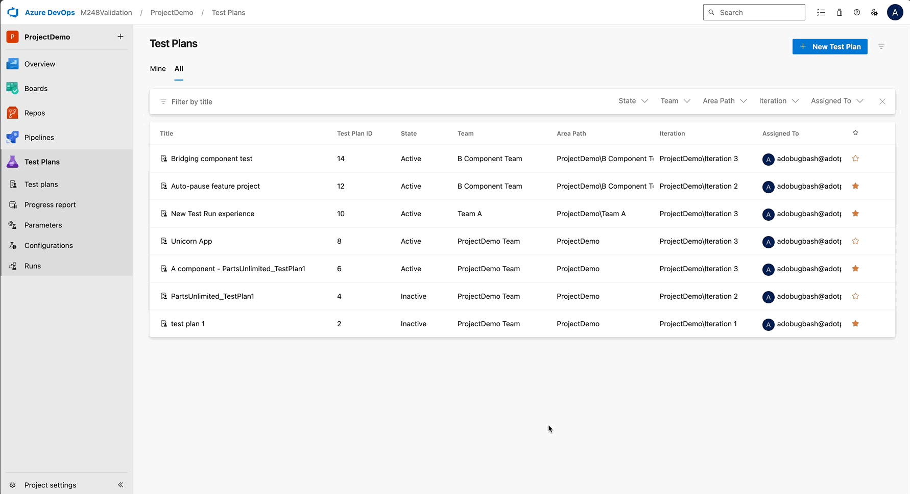

### Introducing New Test Plans directory

Stay organized and save time with the New Test Plans Directory. We are introducing several enhancements to help you manage test plans more efficiently, giving you greater control over your workspace and reducing repetitive tasks.  

> [!div class="mx-imgBorder"]
> 

Here’s what’s new:  

* Cleaner UI Design: Navigate your test plans with ease using a modern interface that improves readability and reduces clutter, allowing you to focus on your tasks without distractions.  

* Column Sorting: Find what you need faster by sorting columns based on name, status, or other key attributes. This feature helps you quickly organize and prioritize your test plans for better productivity.  

* Team Filter in the All tab: Focus on what matters by filtering test plans by team, ensuring you only see relevant plans that align with your work and goals.  

* Persistent Filters: Save time with persistent filters that remember your settings. When you return to the page, your previously applied filters will stay intact, providing an organized view without needing to reapply filters every time. 

These updates are designed to streamline your workflow, reduce repetitive tasks, and make it easier to track and manage your test plans.  Give it a try and let us know via [email](mailto:adocustomerfeedback@service.microsoft.com) what you think!

### Advanced Test Case result history

Easily track key test run details with new enhancements to the test case result page. You’ll see critical information like Run ID, Pipeline ID, Owner, Iteration Path, and Area Path displayed right on the page, providing a complete view of each test run at a glance. 

We've added horizontal scrolling for longer values and customizable columns, allowing you to personalize your layout and keep your preferences saved at the user level. To help you move faster, Run IDs and rows are clickable, giving you quick access to the Test Run view for deeper insights. These updates aim to improve visibility, save time, and streamline your workflow, making it easier to track and manage your test runs efficiently. Give it a try and let us know via [email](mailto:adocustomerfeedback@service.microsoft.com) if you have any feedback. We would love to hear from you!

### View Test Case State in Execute tab

You can now add the **"Test Case State column"** to the **Execute tab** to quickly see the status of each test case. Whether it’s Approved, In Progress, or any other state, this update gives you clearer visibility into test readiness without switching browser tabs or running complex queries. 

The column is optional and can be enabled via the column picker. It also aligns with the existing State filter, allowing you to filter and view test case states side by side, all in one place. 

This enhancement helps ensure testers begin execution with test cases that are truly Ready or Approved, reducing the risk of running incomplete or draft items, and making your test runs more efficient from the start.

### Default resume for paused test case 

Quickly resume your paused test cases with a single click. We've made "Resume" the default action for paused test cases, allowing you to pick up right where you left off without extra navigation. This update makes it faster and easier to continue your work without interruption. 

To further protect your progress, we're introducing a confirmation prompt to prevent accidental overwrites of paused test progress. This safeguard ensures your partially saved work stays intact, giving you peace of mind while managing your test runs. Give it a try and let us know via [email](mailto:adocustomerfeedback@service.microsoft.com) what you think!