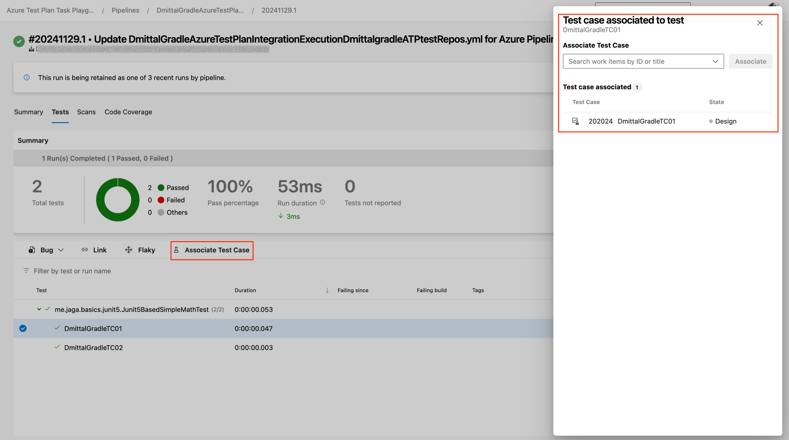

### Ability to associate Java, JavaScript and Python tests to manual test cases

Introducing the ability to associate automated tests written in Java/JUnit (Maven and Gradle), JS (Jest) and Python (PyTest) with manual test cases.

> [!div class="mx-imgBorder"]
> 

Upon completion of the association, you can run your tests within your pipelines using the new [Azure Test Plan](/azure/devops/pipelines/tasks/reference/azure-test-plan-v0?view=azure-pipelines) task. Additionally, you have the option to run your tests on an ad-hoc basis through the [Test Plans](/azure/devops/test/run-automated-tests-from-test-hub?view=azure-devops) experience.