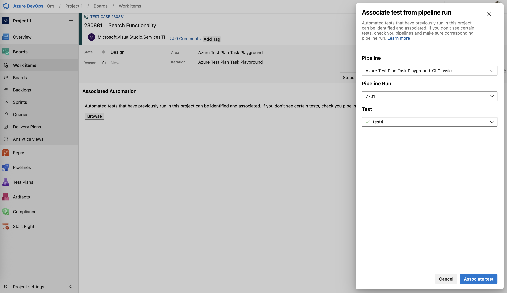

### Associate automated tests to test cases

Previously, support was introduced for [associating automated tests](https://devblogs.microsoft.com/devops/introducing-java-javascript-and-python-support-in-azuredevops-test-plans/) written in various languages with test cases directly from pipelines. This capability has now been extended to allow initiating the association directly from within the test case itself. 

> [!div class="mx-imgBorder"]
> 

### Fixed missing link cleanup when deleting shared steps

Resolved a defect that prevented the Related Work link from being removed when a shared step was deleted from a test case.