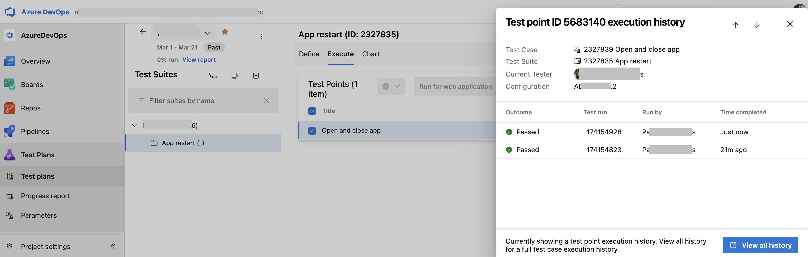

### Focused test point history panel

Previously, you had no easy way to see point-specific history from the Test Plan page, making it hard to differentiate among test points in result history. Now you can view execution history for individual test points directly from the Test Plan page. 

> [!div class="mx-imgBorder"]
> 

### Fixed Back Button navigation in Test Plans

Resolved navigation issues by fixing the Back button functionality, enabling accurate transitions from Test Case view to Test Plan view.