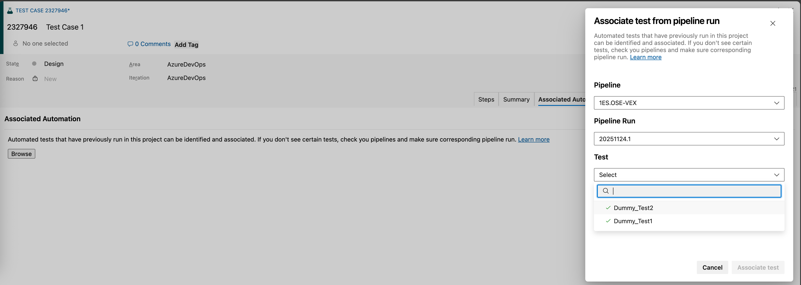
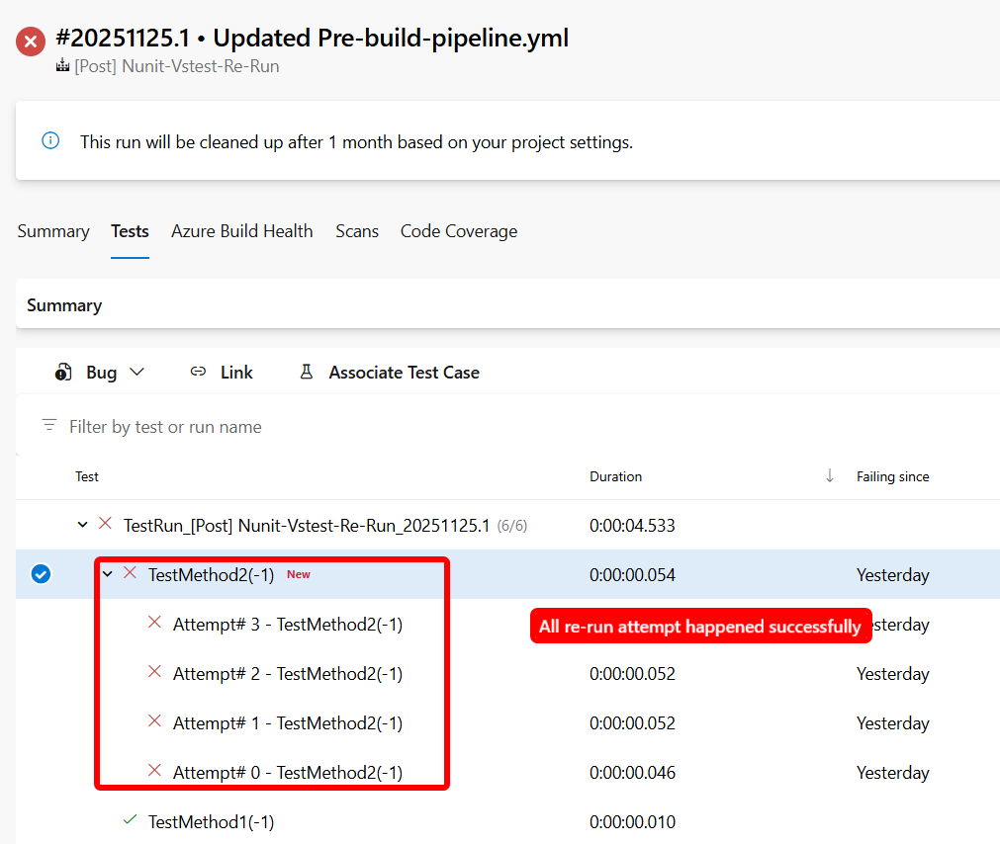

### Associate test cases from work item is now generally available

We’re excited to announce that the automated test association flow introduced in our earlier [blog post](https://devblogs.microsoft.com/devops/introducing-java-javascript-and-python-support-in-azuredevops-test-plans/) is now generally available. In addition to linking automated tests across languages and frameworks, you can now create the same associations directly from the test case itself, making the experience simpler, faster, and more intuitive.

> [!div class="mx-imgBorder"]
> 

### Support for data-driven tests with VSTest task

We’ve added support for data‑driven (parameterized) tests with static inputs across MSTest, NUnit, and xUnit frameworks. In pipeline runs, each data set is now executed and reported as a distinct test attempt, providing better visibility into test coverage and execution outcomes.

> [!div class="mx-imgBorder"]
> 

You can learn more about Visual Studio Test v3 task [here](/azure/devops/pipelines/tasks/reference/vstest-v3?view=azure-pipelines&preserve-view=true).

### Bug fixes and accessibility improvements

This release includes a set of targeted bug fixes and accessibility enhancements focused on improving test workflows, search reliability, and screen reader usability. These updates address issues reported by the Developer Community and make key experiences more inclusive and easier to navigate.

**Bug fixes**

   * Improved “Search for existing bug” ID search logic to make it easier to relate existing bugs during test runs.
   * Fixed the [Test Case View Linked Items Shows Random Work Items](https://developercommunity.visualstudio.com/t/Test-Case-View-Linked-Items-Shows-Random/10556292) issue reported in the Developer Community.
   * Fixed the issue reported in the Developer Community where [Test cases disappeared from the execution grid after changing their execution status while Assigned To filter is applied](https://developercommunity.visualstudio.com/t/-Test-cases-disappear-from-the-execution/10655819). 

**Accessibility improvements**

   * Narrator now announces the correct number of rows and columns in the grid within the **New test case** pane.
   * Added visual label **Description** to the "description" textbox in the **New task** pane for better screen reader support.