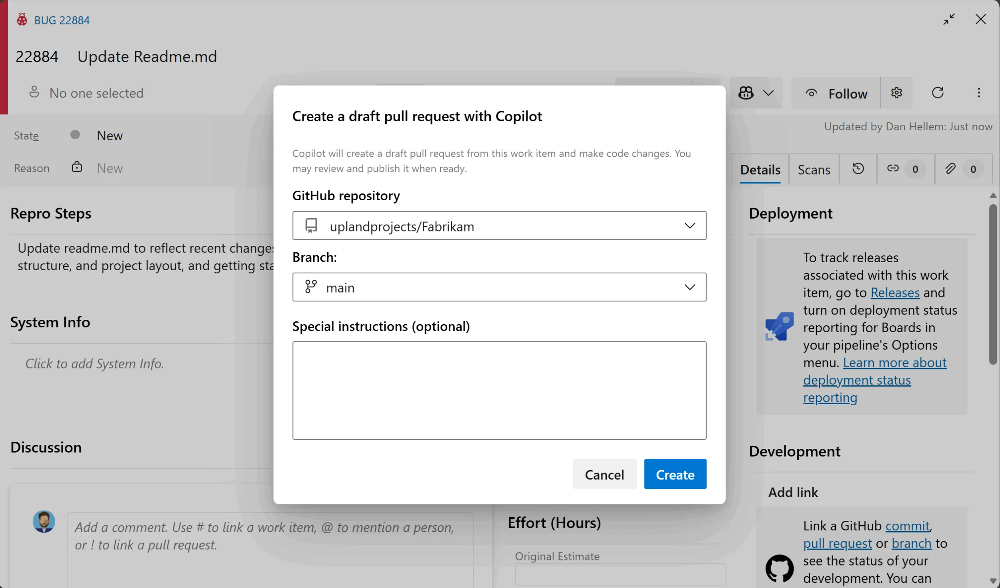

### GitHub Copilot integration for Azure Boards

The GitHub Copilot integration for Azure Boards is now generally available, enabling teams to move more seamlessly from planning to implementation by generating code changes directly from Azure Boards work items. From a work item, developers can invoke Copilot, select a target GitHub repository and branch, and create a draft pull request that remains linked to the original work item, providing end-to-end traceability from work tracking to code.

> 

This release incorporates feedback from the preview, including support for branch selection and visual Copilot status indicators on Kanban cards to improve progress visibility. To learn more, see our [recent blog post](https://devblogs.microsoft.com/devops/github-copilot-for-azure-boards/).

* Please note that this feature is being rolled out in stages and may take a few additional weeks to become available in all organizations.