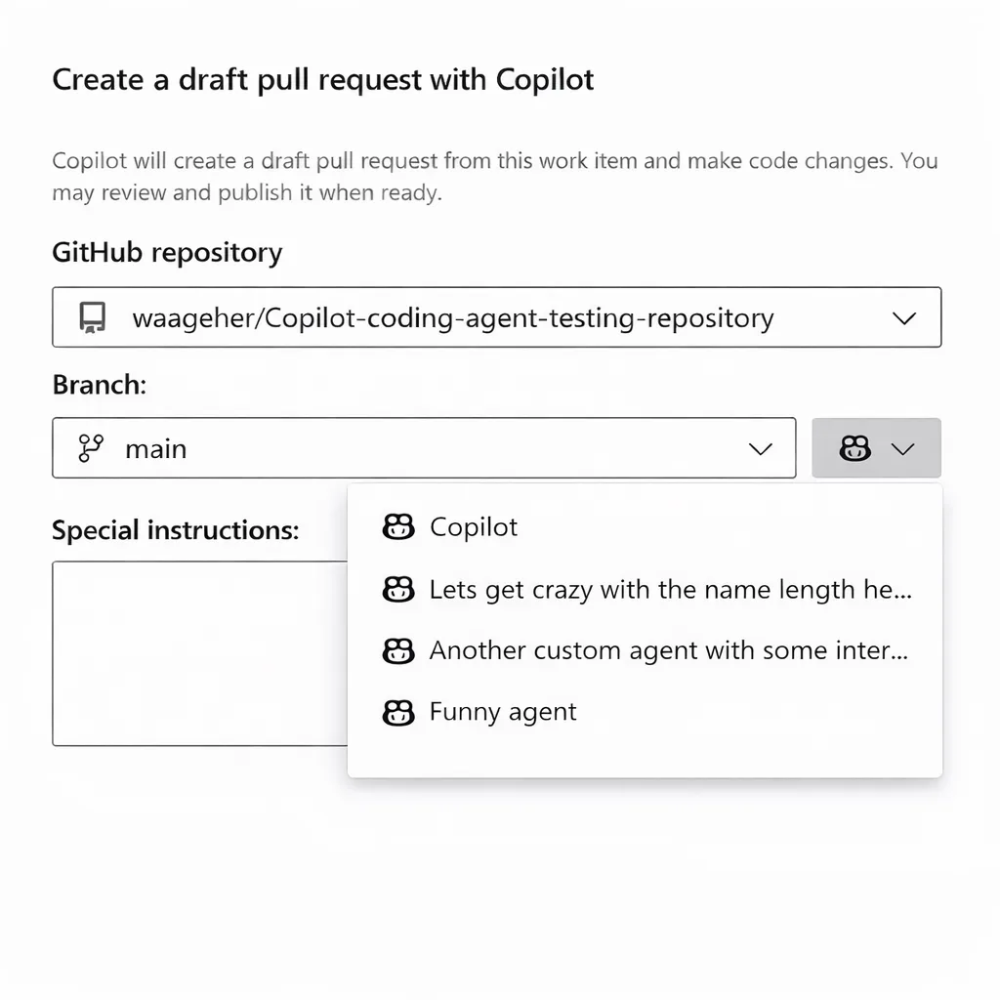

### Azure Boards integration with GitHub Copilot now supports custom agents

The Azure Boards integration with GitHub Copilot now supports the selection of custom agents. If you’re not already familiar with custom agents, you can learn more about them in the documentation on [creating custom agents](https://docs.github.com/en/copilot/how-tos/use-copilot-agents/coding-agent/create-custom-agents).

Once you’ve created a custom agent at the repository or organization level, it will automatically be available in Azure DevOps. When you create a pull request from a work item, you’ll see a new agent selection control next to the repository list.

> 

After selecting a custom agent and clicking **Create**, that agent will be used to generate the code changes and create the pull request in the selected repository.

### Increased maximum limit for connected GitHub repositories

We’ve increased the per-connection limit when linking GitHub repositories to an Azure DevOps project. The new maximum limit in the web experience is now **2,000**, matching the limit already available through the [Update REST API](/rest/api/azure/devops/wit/github-connections/update?view=azure-devops-rest-7.2&tabs=HTTP&preserve-view=true).