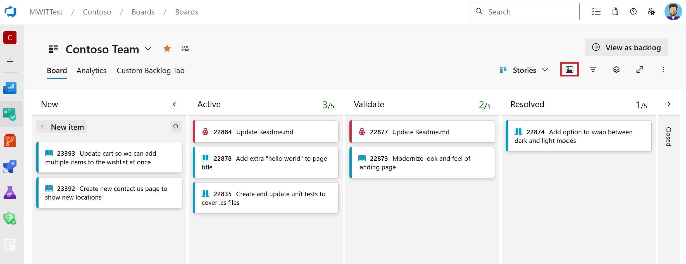

### Condensed card display on Kanban and sprint boards

Just like in [Delivery Plans](/azure/devops/boards/plans/review-team-plans), you can now enable a condensed view on Kanban and Sprint boards to display only the work item title. This is especially helpful for teams with large backlogs, allowing them to see more cards on the board while scrolling less.

To enable condensed view, select the **Collapse card fields** button on the board.

> 