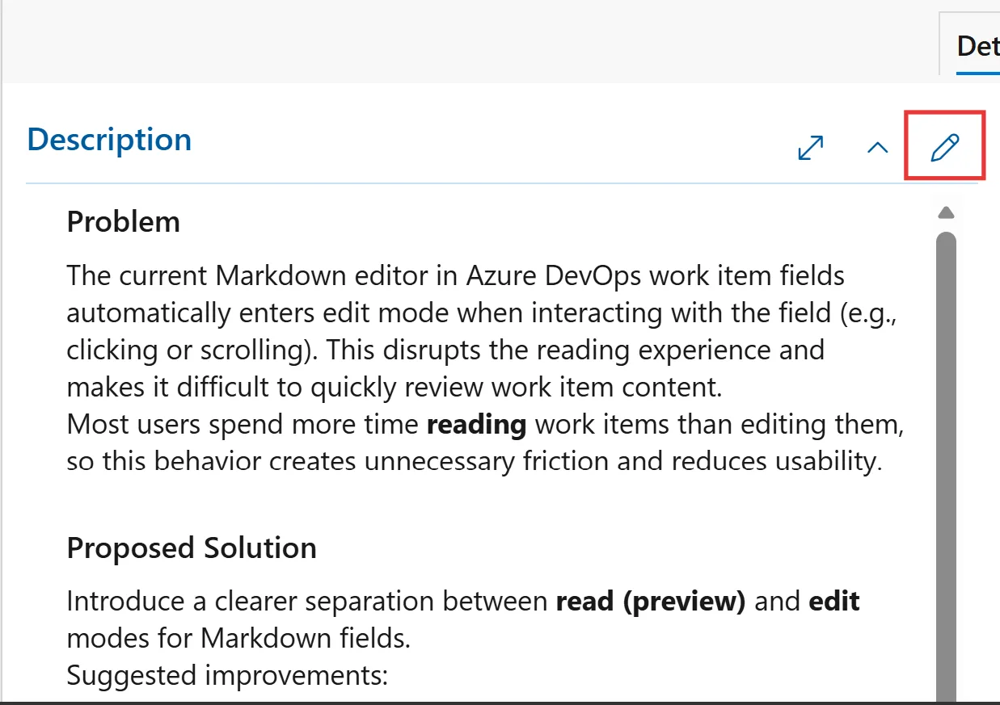
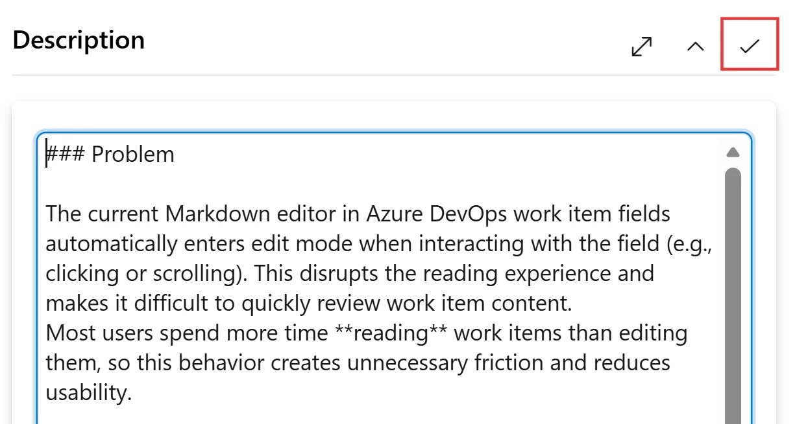
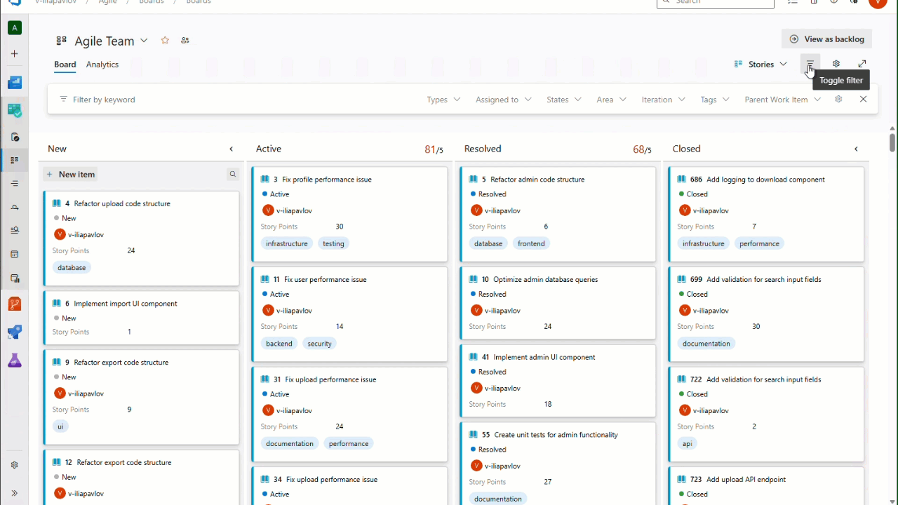

### Improving the Markdown editor for work items

Markdown multi-line fields in Azure DevOps work items now have a clearer separation between preview and edit modes.

By default, fields open in preview mode, allowing you to read and interact with content without accidentally entering edit mode. When you're ready to make changes, select the edit icon at the top of the field to switch into editing.

> [!div class="mx-imgBorder"]
> 

After you complete your updates, you can exit edit mode and return to preview mode.

> [!div class="mx-imgBorder"]
> 

These changes address this [community suggestion ticket](https://developercommunity.visualstudio.com/t/Markdown-editor-for-work-item-multi-line/10935496).

### Filter Boards and backlogs by additional fields

We're excited to introduce the ability to use additional fields as filters on both backlog and Kanban boards. This has been a [long-standing request](https://developercommunity.visualstudio.com/t/add-the-ability-to-filter-boards-by-custom-fields/606538) from the developer community.

With this update, you'll continue to see the same default filters you're familiar with. In addition, you can now open the filter settings and add any field that's already displayed on backlog columns or Kanban cards. Once applied, your selected fields become immediately available in the filter controls, making it easier to refine and focus your work.

> [!div class="mx-imgBorder"]
> 

Filters for sprint backlog and board will be coming soon.
