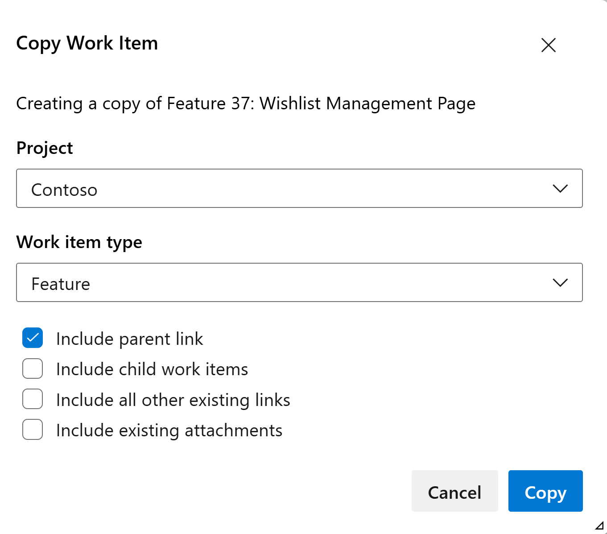

### Improved copy work item choices

We've improved the copy work item experience by decoupling parent and child links. Instead of copying all parent and child links together with the **Include existing links** option, you can now choose to copy only parent links, only child links, or both.

This provides greater flexibility and makes it easier in cases where you want to copy a work item and keep it linked to the same parent without also bringing over all child links.

> [!div class="mx-imgBorder"]
> 

### Enhanced Security for GitHub Integration REST APIs

We’ve upgraded the [GitHub integration REST APIs](/rest/api/azure/devops/wit/github-connections?view=azure-devops-rest-7.2) to use GitHub App OAuth tokens instead of classic OAuth tokens for user authentication. As a security enhancement, users will be prompted to re-authenticate once via a provided URL the first time they interact with GitHub connections after this change.

After completing this one-time step, all API interactions will continue as usual. This update enables automatic token refresh, reducing interruptions and eliminating the need for repeated manual reauthorization.
