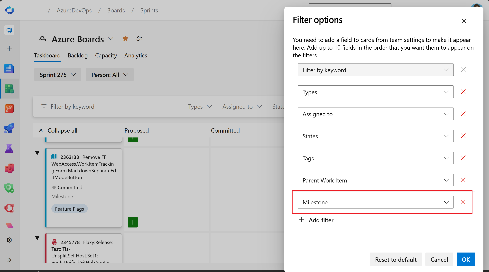

### Filter sprint boards and backlogs by additional fields

Following the introduction of [additional filters for boards and backlogs](/azure/devops/release-notes/2026/sprint-272-update#filter-boards-and-backlogs-by-additional-fields), we've now completed a long-standing request from the developer community to extend this capability to sprint boards and sprint backlogs as well.

Teams can now use additional fields, including custom fields, to filter sprint boards and backlogs, making it easier to find and focus on the right work during sprint planning and execution. This enhancement addresses a highly requested feature originally raised in the [Azure DevOps Developer Community](https://developercommunity.visualstudio.com/t/add-the-ability-to-filter-boards-by-custom-fields/606538).

> [!div class="mx-imgBorder"]
> 
